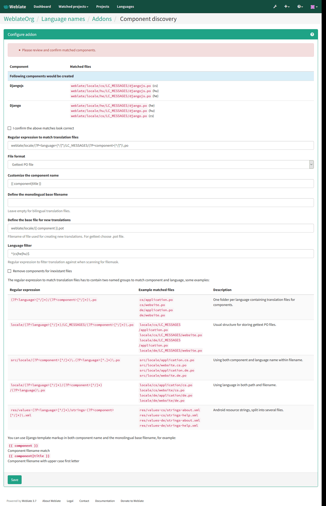

.. _addons:

Addons
======

.. versionadded:: 2.19

Addons provide ways to customize translation workflow. You can install addons
to your translation component and they will work behind the scenes.

.. image:: ../images/addons.png

Built in addons
+++++++++++++++

.. _addon-weblate.cleanup.generic:

Cleanup translation files
-------------------------

Update all translation files to match the monolingual base file. For most file
formats, this means removing stale translation keys no longer present in the
base file.

.. _addon-weblate.discovery.discovery:

Component discovery
-------------------

This addon automatically adds or removes components to the project based on
file changes in the version control system.

It is similar to the :djadmin:`import_project` management command, but the
major difference is that it is triggered on every VCS update. This way you can
easily track multiple translation components within one VCS.

To use component discovery, you first need to create one component which will
act as master and others will use :ref:`internal-urls` to it as a VCS
configuration. You should choose the one which is less likely to disappear in
the future here.

Once you have one component from the target VCS, you can configured the
discovery addon to find all translation components in the VCS. The matching is
done using regular expresion so it can be quite powerful, but it can be complex
to configure. You can use examples in the addon help for some common use cases.

Once you hit save, you will be presented with a preview of matched components,
so you can check whether the configuration actually matches your needs:

.. _addon-weblate.flags.source_edit:

Flag new source strings to need edit
------------------------------------

Whenever a new source string is imported from the VCS, it is flagged as needing
editing in Weblate. This way you can easily filter and edit source strings
written by the developers.

.. _addon-weblate.flags.target_edit:

Flag new translations to need edit
----------------------------------

Whenever a new translation string is imported from the VCS, it is flagged as
needing editing in Weblate. This way you can easily filter and edit
translations created by the developers.

.. _addon-weblate.generate.generate:

Statistics generator
--------------------

This addon generates a file containing detailed information about the
translation.

.. _addon-weblate.gettext.authors:

Contributors in comment
-----------------------

Update comment in the PO file header to include contributor name and years of
contributions.

.. _addon-weblate.gettext.configure:

Update ALL_LINGUAS variable in the configure file
-------------------------------------------------

Updates the ALL_LINGUAS variable in configure, configure.in or configure.ac
files, when a new translation is added.

.. _addon-weblate.gettext.customize:

Customize gettext output
------------------------

Allows customization of gettext output behavior, for example line wrapping.

.. _addon-weblate.gettext.linguas:

Update LINGUAS file
-------------------

Updates the LINGUAS file when a new translation is added.

.. _addon-weblate.gettext.mo:

Generate MO files
-----------------

Automatically generates MO file for every changed PO file.

.. _addon-weblate.gettext.msgmerge:

Update PO files to match POT (msgmerge)
---------------------------------------

Update all PO files to match the POT file using msgmerge. This is triggered
whenever new changes are pulled from the upstream repository.

.. _addon-weblate.json.customize:

Customize JSON output
---------------------

Allows to customize JSON output behavior, for example indentation or sorting.

.. _addon-weblate.properties.sort:

Formats the Java properties file
--------------------------------

This addon sorts the Java properties file.

Writing addon
+++++++++++++

You can write own addons as well, all you need to do is subclass ``BaseAddon``,
define addon metadata and implement callback which will do the processing.

You can look at example addon for more information:

.. literalinclude:: ../../weblate/addons/example.py
    :language: python
