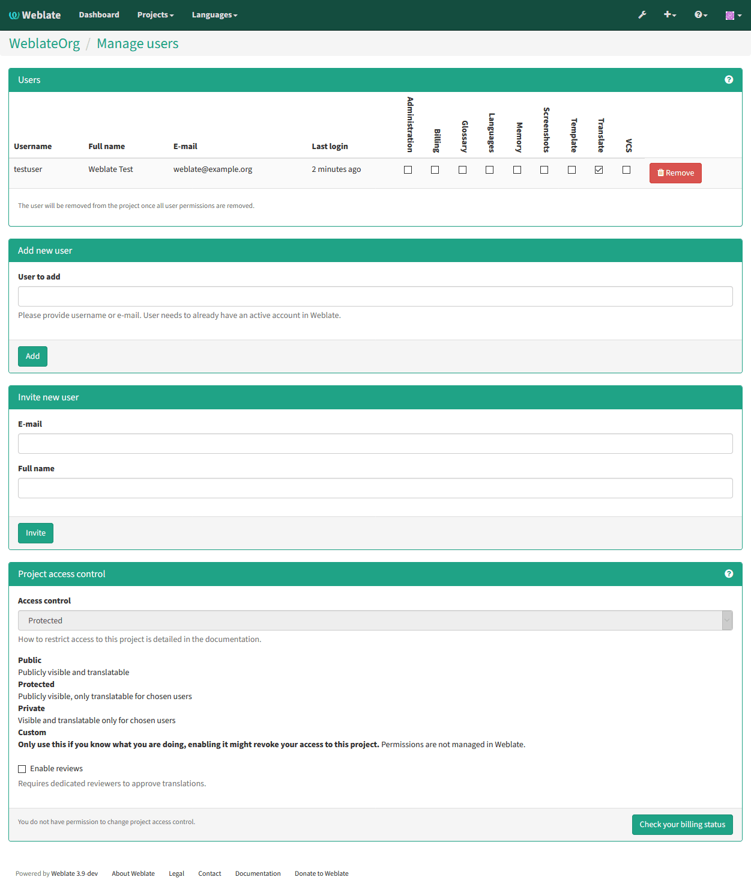

Authentication
==============

User registration
-----------------

The default setup for Weblate is to use python-social-auth for handling new
users. This allows them to register using form on the website and after
confirming their email they can contribute or by using some third party service
to authenticate.

You can also completely disable new users registration using
:setting:`REGISTRATION_OPEN`.

Authentication backends
-----------------------

By default Weblate uses Django built-in authentication and includes various
social authentication options. Thanks to using Django authentication, you can
also import user database from other Django based projects (see
:ref:`pootle-migration`).

Django can be additionally configured to authenticate against other means as
well.

Social authentication
+++++++++++++++++++++

Thanks to `python-social-auth <http://psa.matiasaguirre.net/>`_, Weblate
support authentication using many third party services such as Facebook,
GitHub, Google or Bitbucket.

Please check their documentation for generic configuration instructions:

http://psa.matiasaguirre.net/docs/configuration/django.html

.. note::

    By default, Weblate relies on third-party authentication services to
    provide validated email address, in case some of services you want to use
    do not support this, please remove
    ``social.pipeline.social_auth.associate_by_email`` from
    ``SOCIAL_AUTH_PIPELINE`` settings.

Enabling individual backends is quite easy, it's just matter of adding entry to
``AUTHENTICATION_BACKENDS`` setting and possibly adding keys needed for given
authentication. Please note that some backends do not provide user email by
default, you have to request it explicitly, otherwise Weblate will not be able
to properly credit users contributions.

For example, enabling authentication against GitHub:

.. code-block:: python
    
    # Authentication configuration
    AUTHENTICATION_BACKENDS = (
        'social.backends.github.GithubOAuth2',
        'social.backends.email.EmailAuth',
        'weblate.accounts.auth.WeblateUserBackend',
    )

    # Social auth backends setup
    SOCIAL_AUTH_GITHUB_KEY = 'GitHub Client ID'
    SOCIAL_AUTH_GITHUB_SECRET = 'GitHub Client Secret'
    SOCIAL_AUTH_GITHUB_SCOPE = ['user:email']

.. seealso:: http://psa.matiasaguirre.net/docs/backends/index.html

LDAP authentication
+++++++++++++++++++

LDAP authentication can be best achieved using `django-auth-ldap` package. You
can install it by usual means:

.. code-block:: sh

    # Using PyPI
    pip install django-auth-ldap

    # Using apt-get
    apt-get install python-django-auth-ldap

Once you have the package installed, you can hook it to Django authentication:

.. code-block:: python

    # Add LDAP backed, keep Django one if you want to be able to login
    # even without LDAP for admin account
    AUTHENTICATION_BACKENDS = (
        'django_auth_ldap.backend.LDAPBackend',
        'django.contrib.auth.backends.ModelBackend',
    )

    # LDAP server address
    AUTH_LDAP_SERVER_URI = 'ldaps://ldap.example.net'

    # DN to use for authentication
    AUTH_LDAP_USER_DN_TEMPLATE = 'cn=%(user)s,o=Example'
    # Depending on your LDAP server, you might use different DN
    # like:
    # AUTH_LDAP_USER_DN_TEMPLATE = 'ou=users,dc=example,dc=com'

    # List of attributes to import from LDAP on login
    AUTH_LDAP_USER_ATTR_MAP = {
        'first_name': 'name',
        'email': 'mail',
    }

.. seealso:: http://pythonhosted.org/django-auth-ldap/

.. _privileges:

Access control
--------------

Weblate uses privileges system based on Django.  The default setup (after you
run :djadmin:`setupgroups`) consists of three groups `Guests`, `Users` and
`Managers` which have privileges as described above.  All new users are
automatically added to `Users` group. The `Guests` groups is used for not
logged in users.

Basically `Users` are meant as regular translators and `Managers` for
developers who need more control over the translation - they can force
committing changes to VCS, push changes upstream (if Weblate is configured to do
so) or disable translation (eg. when there are some major changes happening
upstream). 

To customize this setup, it is recommended to remove privileges from `Users`
group and create additional groups with finer privileges (eg. `Translators`
group, which will be allowed to save translations and manage suggestions) and
add selected users to this group. You can do all this from Django admin
interface.

To completely lock down your Weblate installation you can use
:setting:`LOGIN_REQUIRED_URLS` for forcing users to login and
:setting:`REGISTRATION_OPEN` for disallowing new registrations.

Extra privileges
++++++++++++++++

Weblate defines following extra privileges:

Can upload translation [Users, Managers]
    Uploading of translation files.
Can overwrite with translation upload [Users, Managers]
    Overwriting existing translations by uploading translation file.
Can define author of translation upload [Managers]
    Allows to define custom authorship when uploading translation file.
Can force committing of translation [Managers]
    Can force VCS commit in the web interface.
Can see VCS repository URL [Users, Managers, Guests]
    Can see VCS repository URL inside Weblate
Can update translation from VCS [Managers]
    Can force VCS pull in the web interface.
Can push translations to remote VCS [Managers]
    Can force VCS push in the web interface.
Can do automatic translation using other project strings [Managers]
    Can do automatic translation based on strings from other components
Can lock whole translation project [Managers]
    Can lock translation for updates, useful while doing some major changes 
    in the project.
Can reset translations to match remote VCS [Managers]
    Can reset VCS repository to match remote VCS.
Can save translation [Users, Managers]
    Can save translation (might be disabled with :ref:`voting`).
Can accept suggestion [Users, Managers]
    Can accept suggestion (might be disabled with :ref:`voting`).
Can delete suggestion [Users, Managers]
    Can delete suggestion (might be disabled with :ref:`voting`).
Can delete comment [Managers]
    Can delete comment.
Can vote for suggestion [Users, Managers]
    Can vote for suggestion (see :ref:`voting`).
Can override suggestion state [Managers]
    Can save translation, accept or delete suggestion when automatic accepting
    by voting for suggestions is enabled (see :ref:`voting`).
Can import dictionary [Users, Managers]
    Can import dictionary from translation file.
Can add dictionary [Users, Managers]
    Can add dictionary entries.
Can change dictionary [Users, Managers]
    Can change dictionary entries.
Can delete dictionary [Users, Managers]
    Can delete dictionary entries.
Can lock translation for translating [Users, Managers]
    Can lock translation while translating (see :ref:`locking`).
Can add suggestion [Users, Managers, Guests]
    Can add new suggestions.
Can use machine translation [Users, Managers]
    Can use machine translations (see :ref:`machine-translation-setup`).
Can manage ACL rules for a project [Managers]
    Can add users to ACL controlled projects (see :ref:`acl`)
Can edit priority [Managers]
    Can adjust source string priority
Can edit check flags [Managers]
    Can adjust source string check flags

.. _acl:

Per project access control
++++++++++++++++++++++++++

.. versionadded:: 1.4

    This feature is available since Weblate 1.4.

.. note::

    By enabling ACL, all users are prohibited to access anything within given
    project unless you add them the permission to do that.

Additionally you can limit users access to individual projects. This feature is
enabled by :guilabel:`Enable ACL` at Project configuration. Once you enable
this, users without specific privilege 
(:guilabel:`trans | project | Can access project NAME`) can not access this
project. An user group with same name as a project is also automatically
created to ease you management of the privilege.

To allow access to this project, you have to add the privilege to do so either
directly to given user or group of users in Django admin interface. Or using
user management on project page as described in :ref:`manage-acl`.

.. seealso:: https://docs.djangoproject.com/en/1.7/topics/auth/default/#auth-admin

Managing users and groups
-------------------------

All users and groups can be managed using Django admin interface, which is
available under :file:`/admin/` URL.

.. _manage-acl:

Managing per project access control
+++++++++++++++++++++++++++++++++++

.. note::

    This feature only works for ACL controlled projects, see :ref:`acl`.

Users with :guilabel:`Can manage ACL rules for a project` privilege (see
:ref:`privileges`) can also manage users in projects with access control
enabled on the project page.

The user management is available in :guilabel:`Tools` menu of a project:

.. seealso:: :ref:`acl`
