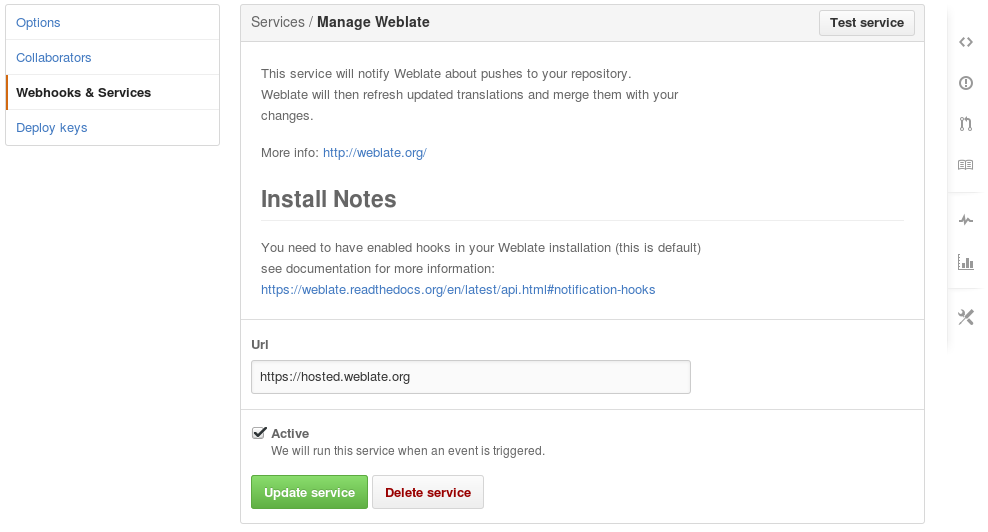
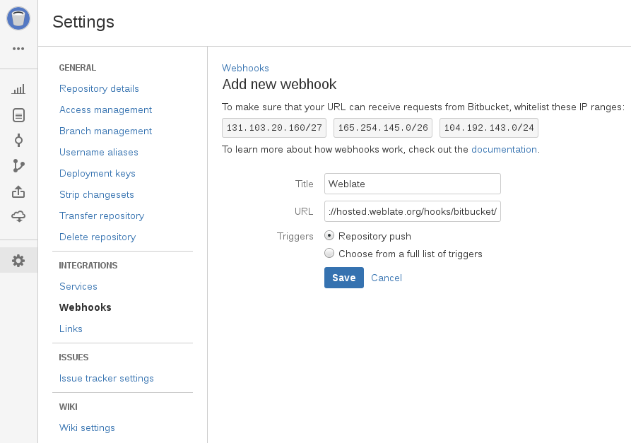

.. _continuous-translation:

Continuous translation
======================

Weblate provides you great infrastructure for translation to closely follow
your development. This way translators can work on translations whole time and
are not forced to translate huge amount of new texts before release.

The complete process can be described in following steps:

1. Developers make some changes and push them to the VCS repository.
2. Optionally the translation files are updated (this depends on the file format, see :ref:`translations-update`).
3. Weblate pulls changes from the VCS repository, see :ref:`update-vcs`.
4. Once Weblate detects changes in translations, translators will be notified based on their subscription settings.
5. Translators make translations using Weblate web interface.
6. Once translators are done, Weblate commits the changes to the local repository (see :ref:`lazy-commit`) and pushes them back if it has permissions to do that (see :ref:`push-changes`).

.. graphviz::

    digraph translations {
        "Developers" [shape=box, fillcolor=lightgreen, style=filled];
        "Translators" [shape=box, fillcolor=lightgreen, style=filled];

        "Developers" -> "VCS repository" [label=" 1. Push "];

        "VCS repository" -> "VCS repository" [label=" 2. Updating translations ", style=dotted];

        "VCS repository" -> "Weblate" [label=" 3. Pull "];

        "Weblate" -> "Translators" [label=" 4. Notification "];

        "Translators" -> "Weblate" [label=" 5. Translate "];

        "Weblate" -> "VCS repository" [label=" 6. Push "];
    }

.. _update-vcs:

Updating repositories
---------------------

You should set up some way how backend repositories are updated from their
source. You can either use hooks (see :ref:`hooks`) or just regularly run
:djadmin:`updategit --all`.

Whenever Weblate updates the repository, the :guilabel:`Post-update script`
hooks are executed.

With Gettext po files, you might be often bitten by conflict in PO file
headers. To avoid it, you can use shipped merge driver
(:file:`examples/git-merge-gettext-po`). To use it just put following
configuration to your :file:`.gitconfig`:

.. code-block:: ini

   [merge "merge-gettext-po"]
     name = merge driver for gettext po files
     driver = /path/to/weblate/examples/git-merge-gettext-po %O %A %B

And enable its use by defining proper attributes in given repository (eg. in
:file:`.git/info/attributes`)::

    *.po merge=merge-gettext-po

.. note::

    This merge driver assumes the changes in POT files always are done in branch
    we're trying to merge.

.. _github-setup:

Automatically receiving changes from GitHub
+++++++++++++++++++++++++++++++++++++++++++

Weblate comes with native support for GitHub. To receive notifications on every
push to GitHub repository, you just need to enable Weblate Service in the
repository settings (:guilabel:`Webhooks & Services`) as shown on the image below:

.. image:: ../images/github-settings.png

To set the base URL of your Weblate installation (for example
``https://hosted.weblate.org``) and Weblate will be notified about every push
to GitHub repository:

You can also use generic :guilabel:`Webhook`, in that case the
:guilabel:`Payload URL` would have to be full path to the handler, for example
``https://hosted.weblate.org/hooks/github/``.

.. seealso::
   
   :http:post:`/hooks/github/`, :ref:`hosted-push`

.. _bitbucket-setup:

Automatically receiving changes from Bitbucket
++++++++++++++++++++++++++++++++++++++++++++++

Weblate has support for Bitbucket webhooks, all you need to do is add webhook
which triggers on repository push with destination to ``/hooks/bitbucket/`` URL
on your Weblate installation (for example
``https://hosted.weblate.org/hooks/bitbucket/``).

.. seealso:: 
   
   :http:post:`/hooks/bitbucket/`, :ref:`hosted-push`

.. _gitlab-setup:

Automatically receiving changes from GitLab
+++++++++++++++++++++++++++++++++++++++++++

Weblate has support for GitLab hooks, all you need to do is add project web hook
with destination to ``/hooks/gitlab/`` URL on your Weblate installation
(for example ``https://hosted.weblate.org/hooks/gitlab/``).

.. seealso:: 
   
   :http:post:`/hooks/gitlab/`, :ref:`hosted-push`

.. _push-changes:

Pushing changes
---------------

Each project can have configured push URL and in such case Weblate offers
button to push changes to remote repository in web interface.
Weblate can be also configured to automatically push changes on every commit.

If you are using SSH to push, you will need to have a key without a passphrase
(or use ssh-agent for Django) and the remote server needs to be verified by you
via the admin interface first, otherwise pushing will fail.

The push options differ based on used :ref:`vcs`, please check that chapter for
more details.

.. note::

   You can also enable automatic pushing changes on commit, this can be done in
   project configuration.

.. seealso::

    See :ref:`vcs-repos` for setting up SSH keys and :ref:`lazy-commit` for
    information about when Weblate decides to commit changes.

.. _hosted-push:

Pushing changes from Hosted Weblate
+++++++++++++++++++++++++++++++++++

For Hosted Weblate there is dedicated push user registered on GitHub, Bitbucket
and GitLab (with username :guilabel:`weblate` and named
:guilabel:`Weblate push user`). You need to add this user as a collabolator and
give him permissions to push to your repository. Let us know when you've done
so and we will enable pushing changes from Hosted Weblate for you.

.. _merge-rebase:

Merge or rebase
---------------

By default Weblate merges upstream repository into its own. This is safest way
in case you also access underlying repository by other means. In case you don't
need this, you can enable rebasing of changes on upstream, what will produce
history with less merge commits.

.. note::

    Rebasing can cause you troubles in case of complicated merges, so carefully
    consider whether you want to enable them or not.

Interacting with others
-----------------------

Weblate makes it easy to interact with others using its API.

.. seealso:: 
   
   :ref:`api`

.. _lazy-commit:

Lazy commits
------------

Default behaviour (configured by :setting:`LAZY_COMMITS`) of Weblate is to group
commits from same author into one if possible. This heavily reduces number of
commits, however you might need to explicitly tell to do the commits in case
you want to get VCS repository in sync, eg. for merge (this is by default
allowed for Managers group, see :ref:`privileges`).

The changes are in this mode committed once any of following conditions is
fulfilled:

* somebody else works on the translation
* merge from upstream occurs
* import of translation happens
* translation for a language is completed
* explicit commit is requested

You can also additionally set a cron job to commit pending changes after some
delay, see :djadmin:`commit_pending` and :ref:`production-cron`.

.. _processing:

Processing repository with scripts
----------------------------------

You can customize way how Weblate manipulates with repository by set of
scripts. These include :guilabel:`Post-update script`, :guilabel:`Pre-commit
script`, :guilabel:`Post-commit script`, :guilabel:`Post-add script` and
:guilabel:`Post-push script` and are briefly described in :ref:`component`.

Their naming quite clearly tells when given script is executed. The commit
related scripts always get one parameter with full path to the translation file
which has been changed.

The script is executed with the current directory set to root of VCS repository
for given component.

Additionally following environment variables are available:

.. envvar:: WL_VCS

    Used version control system.

.. envvar:: WL_REPO

    Upstream repository URL.

.. envvar:: WL_PATH

    Absolute path to VCS repository.

.. envvar:: WL_FILEMASK

    File mask for current component.

.. envvar:: WL_TEMPLATE

    File name of template for monolingual translations (can be empty).

.. envvar:: WL_FILE_FORMAT

    File format used in current component.

.. envvar:: WL_LANGUAGE

    Language of currently processed translation (not available for component
    level hooks).

.. seealso::

    :setting:`POST_UPDATE_SCRIPTS`,
    :setting:`PRE_COMMIT_SCRIPTS`,
    :setting:`POST_COMMIT_SCRIPTS`,
    :setting:`POST_PUSH_SCRIPTS`,
    :ref:`component`

Post update repository processing
+++++++++++++++++++++++++++++++++

Post update repository processing can be used to update translation files on
the source change. To achieve this, please remember that Weblate only sees
files which are committed to the VCS, so you need to commit changes as a part
of the script.

For example with gulp you can do it using following code:

.. code-block:: sh

    #! /bin/sh
    gulp --gulpfile gulp-i18n-extract.js
    git commit -m 'Update source strings' src/languages/en.lang.json

Pre commit processing of translations
+++++++++++++++++++++++++++++++++++++

In many cases you might want to automatically do some changes to translation
before it is committed to the repository. The pre commit script is exactly the
place to achieve this.

Before using any scripts, you need to list them in
:setting:`PRE_COMMIT_SCRIPTS` configuration variable. Then you can enable them
at :ref:`component` configuration as :guilabel:`Pre commit script`.

It is passed single parameter consisting of file name of current translation.

The script can also generate additional file to be included in the commit. This
can be configured as :guilabel:`Extra commit file` at :ref:`component`
configuration. You can use following format strings in the filename:

``%(language)s``
    Language code

Example - generating mo files in repository
+++++++++++++++++++++++++++++++++++++++++++

Allow usage of the hook in the configuration

.. code-block:: python

    PRE_COMMIT_SCRIPTS = (
        '/usr/share/weblate/examples/hook-generate-mo',
    )

To enable it, choose now :guilabel:`hook-generate-mo` as :guilabel:`Pre commit
script`. You will also want to add path to generated files to be included in
VCS commit, for example ``po/%(language)s.mo`` as :guilabel:`Extra commit file`.

You can find more example scripts in ``examples`` folder within Weblate sources,
their name start with ``hook-``.
