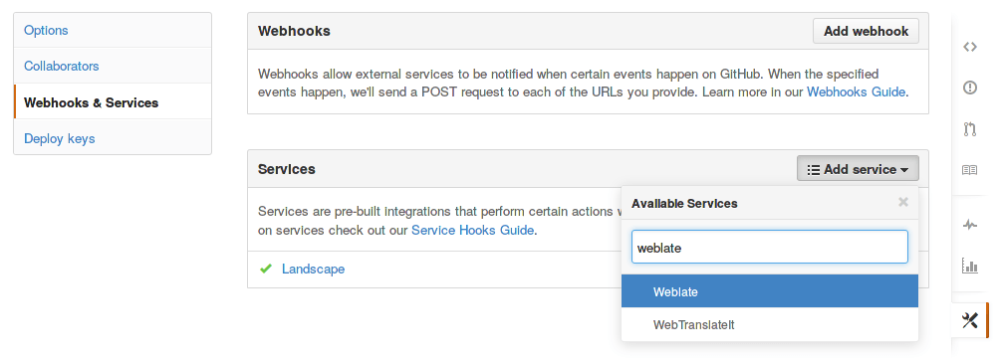

.. _continuous-translation:

Continuous translation
======================

Weblate provides you great infrastructure for translation to closely follow
your development. This way translators can work on translations whole time and
are not forced to translate huge amount of new texts before release.

Updating repositories
---------------------

You should set up some way how backend repositories are updated from their
source. You can either use hooks (see :ref:`hooks`) or just regularly run
:djadmin:`updategit --all`.

With Gettext po files, you might be often bitten by conflict in PO file
headers. To avoid it, you can use shipped merge driver
(:file:`examples/git-merge-gettext-po`). To use it just put following
configuration to your :file:`.gitconfig`:

.. code-block:: ini

   [merge "merge-gettext-po"]
     name = merge driver for gettext po files
     driver = /path/to/weblate/examples/git-merge-gettext-po %O %A %B

And enable it's use by defining proper attributes in given repository (eg. in
:file:`.git/info/attributes`)::

    *.po merge=merge-gettext-po

.. note::

    This merge driver assumes the changes in POT files always are done in branch
    we're trying to merge.

.. _github-setup:

Automatically receiving changes from GitHub
+++++++++++++++++++++++++++++++++++++++++++

Weblate comes with native support for GitHub. To receive notifications on every
push to GitHub repository, you just need to enable Weblate Service in the
repository settings as shown on the image below:

The set the base URL of your Weblate installation (for example
``https://hosted.weblate.org``) and Weblate will be notified about every push
to GitHub repository.

.. seealso:: :http:post:`/hooks/github/`

.. _bitbucket-setup:

Automatically receiving changes from Bitbucket
++++++++++++++++++++++++++++++++++++++++++++++

Weblate has support for Bitbucket hooks, all you need to do is add POST hook
with destination to ``/hooks/bitbucket/`` URL on your Weblate installation
(for example ``https://hosted.weblate.org/hooks/bitbucket/``).

.. seealso:: :http:post:`/hooks/bitbucket/`

.. _gitlab-setup:

Automatically receiving changes from GitLab
+++++++++++++++++++++++++++++++++++++++++++

Weblate has support for GitLab hooks, all you need to do is add project web hook
with destination to ``/hooks/gitlab/`` URL on your Weblate installation
(for example ``https://hosted.weblate.org/hooks/gitlab/``).

.. seealso:: :http:post:`/hooks/gitlab/`

.. _push-changes:

Pushing changes
---------------

Each project can have configured push URL and in such case Weblate offers
button to push changes to remote repository in web interface.

If you are using SSH to push, you will need to have a key without a passphrase
(or use ssh-agent for Django) and the remote server needs to be verified by you
via the admin interface first, otherwise pushing will fail.

.. note::

   You can also enable automatic pushing changes on commit, this can be done in
   project configuration.

.. seealso:: :ref:`private` for setting up SSH keys

.. _merge-rebase:

Merge or rebase
---------------

By default Weblate merges upstream repository into it's own. This is safest way
in case you also access underlying repository by other means. In case you don't
need this, you can enable rebasing of changes on upstream, what will produce
history with less merge commits.

.. note::

    Rebasing can cause you troubles in case of complicated merges, so carefully 
    consider whether you want to enable them or not.

Interacting with others
-----------------------

Weblate makes it easy to interact with others using it's API.

.. seealso:: :ref:`api`

.. _lazy-commit:

Lazy commits
------------

Default behaviour (configured by :setting:`LAZY_COMMITS`) of Weblate is to group
commits from same author into one if possible. This heavily reduces number of
commits, however you might need to explicitly tell to do the commits in case
you want to get VCS repository in sync, eg. for merge (this is by default
allowed for Managers group, see :ref:`privileges`).

The changes are in this mode committed once any of following conditions is
fulfilled:

* somebody else works on the translation
* merge from upstream occurs
* import of translation happens
* translation for a language is completed
* explicit commit is requested

You can also additionally set a cron job to commit pending changes after some
delay, see :djadmin:`commit_pending`.

.. _processing:

Pre commit processing of translations
-------------------------------------

In many cases you might want to automatically do some changes to translation
before it is committed to the repository. The pre commit script is exactly the
place to achieve this.

Before using any scripts, you need to list them in
:setting:`PRE_COMMIT_SCRIPTS` configuration variable. Then you can enable them
at :ref:`component` configuration as :guilabel:`Pre commit script`.

The hook script is executed using system() call, so it is evaluated in a shell.
It is passed single parameter consisting of file name of current translation.

The script can also generate additional file to be included in the commit. This
can be configured as :guilabel:`Extra commit file` at :ref:`component`
configuration. You can use following format strings in the filename:

``%(language)s``
    Language code

Example - generating mo files in repository
+++++++++++++++++++++++++++++++++++++++++++

Allow usage of the hook in the configuration

.. code-block:: python

    PRE_COMMIT_SCRIPTS = (
        '/usr/share/weblate/examples/hook-generate-mo',
    )

To enable it, choose now :guilabel:`hook-generate-mo` as :guilabel:`Pre commit
script`. You will also want to add path to generated files to be included in
VCS commit, for example ``po/%(language)s.mo`` as :guilabel:`Extra commit file`.

You can find more example scripts in ``examples`` folder within Weblate sources,
their name start with ``hook-``.
