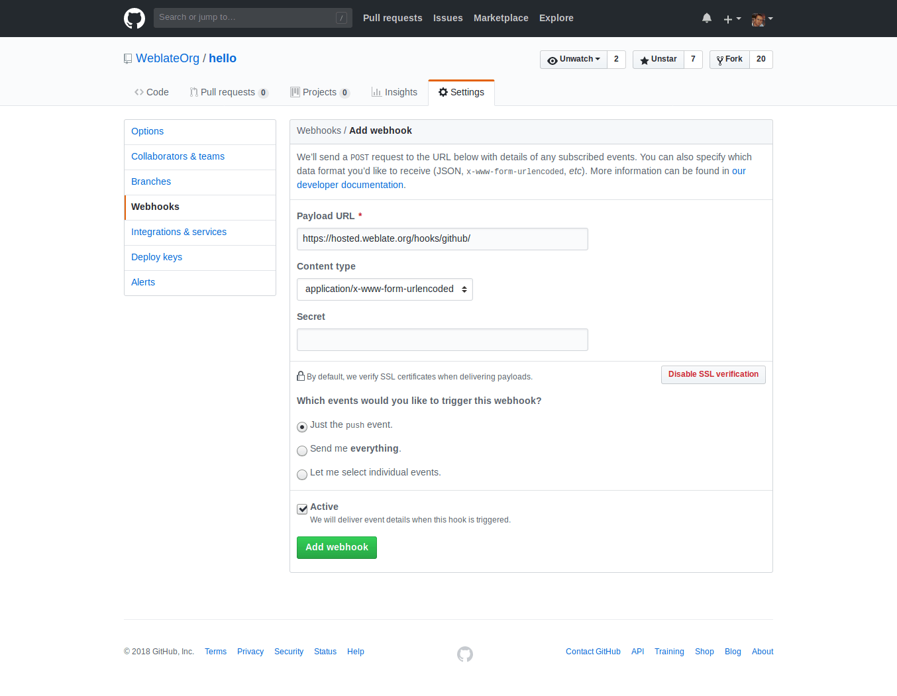

.. _continuous-translation:

Continuous translation
======================

Weblate provides you with a great infrastructure for translation to closely follow
your development. This way translators can work on translations the entire time and
are not forced to translate a huge amount of new texts before release.

The complete process can be described in following steps:

1. Developers make some changes and push them to the VCS repository.
2. Optionally the translation files are updated (this depends on the file format, see :ref:`translations-update`).
3. Weblate pulls changes from the VCS repository, see :ref:`update-vcs`.
4. Once Weblate detects changes in translations, translators will be notified based on their subscription settings.
5. Translators make translations using Weblate web interface.
6. Once translators are done, Weblate commits the changes to the local repository (see :ref:`lazy-commit`) and pushes them back if it has permissions to do that (see :ref:`push-changes`).

.. graphviz::

    digraph translations {
        "Developers" [shape=box, fillcolor=lightgreen, style=filled];
        "Translators" [shape=box, fillcolor=lightgreen, style=filled];

        "Developers" -> "VCS repository" [label=" 1. Push "];

        "VCS repository" -> "VCS repository" [label=" 2. Updating translations ", style=dotted];

        "VCS repository" -> "Weblate" [label=" 3. Pull "];

        "Weblate" -> "Translators" [label=" 4. Notification "];

        "Translators" -> "Weblate" [label=" 5. Translate "];

        "Weblate" -> "VCS repository" [label=" 6. Push "];
    }

.. _update-vcs:

Updating repositories
---------------------

You should set up some way how backend repositories are updated from their
source. You can either use hooks (see :ref:`hooks`) or just regularly run
:djadmin:`updategit` (with selection of project or `--all` for updating all).

Whenever Weblate updates the repository, the :guilabel:`Post-update script`
hooks are executed.

With Gettext po files, you might be often bitten by conflict in PO file
headers. To avoid it, you can use shipped merge driver
(:file:`examples/git-merge-gettext-po`). To use it just put following
configuration to your :file:`.gitconfig`:

.. code-block:: ini

   [merge "merge-gettext-po"]
     name = merge driver for gettext po files
     driver = /path/to/weblate/examples/git-merge-gettext-po %O %A %B

And enable its use by defining proper attributes in given repository (eg. in
:file:`.git/info/attributes`)::

    *.po merge=merge-gettext-po

.. note::

    This merge driver assumes the changes in POT files always are done in the branch
    we're trying to merge.

.. versionchanged:: 2.9

    This merge driver is now automatically installed for all Weblate internal
    repositories.

.. _avoid-merge-conflicts:

Avoiding merge conflicts
++++++++++++++++++++++++

To avoid merge conflicts you should control when to update translation files in
upstream repository to avoid Weblate having changes on same file.

You can achieve this using :ref:`api` to force Weblate push all pending changes
and lock translation while you are doing changes on your side.

The script for doing updates can look like:

.. code-block:: sh

    # Lock Weblate translation
    wlc lock
    # Push changes from Weblate to upstream repository
    wlc push
    # Pull changes from upstream repository to your local copy
    git pull
    # Update translation files, this example is for Django
    ./manage.py makemessages --keep-pot -a
    git commit -m 'Locale updates' -- locale
    # Push changes to upstream repository
    git push
    # Tell Weblate to pull changes (not needed if Weblate follows your repo 
    # automatically)
    wlc pull
    # Unlock translations
    wlc unlock

If you have multiple components sharing same repository, you need to lock them
all separatey:

.. code-block:: sh

    wlc lock foo/bar
    wlc lock foo/baz
    wlc lock foo/baj

.. note::

    The example uses :ref:`wlc`, which will need configuration (API keys) to be
    able to control Weblate remotely. You can also achieve this using any HTTP
    client instead of wlc, eg. curl, see :ref:`api`.

.. _github-setup:

Automatically receiving changes from GitHub
+++++++++++++++++++++++++++++++++++++++++++

Weblate comes with native support for GitHub. To receive notifications on every
push to GitHub repository, you just need to add Weblate Webhook in the
repository settings (:guilabel:`Webhooks`) as shown on the image below:

For the payload URL append ``/hooks/github/`` to your Weblate URL, for example
for Hosted Weblate service this is ``https://hosted.weblate.org/hooks/github/``.

You can leave other values on the default settings (Weblate can handle both
content types and consumes just the `push` event).

.. seealso::
   
   :http:post:`/hooks/github/`, :ref:`hosted-push`

.. _bitbucket-setup:

Automatically receiving changes from Bitbucket
++++++++++++++++++++++++++++++++++++++++++++++

Weblate has support for Bitbucket webhooks, all you need to do is add a webhook
which triggers on repository push with destination to ``/hooks/bitbucket/`` URL
on your Weblate installation (for example
``https://hosted.weblate.org/hooks/bitbucket/``).

.. image:: ../images/bitbucket-settings.png

.. seealso:: 
   
   :http:post:`/hooks/bitbucket/`, :ref:`hosted-push`

.. _gitlab-setup:

Automatically receiving changes from GitLab
+++++++++++++++++++++++++++++++++++++++++++

Weblate has support for GitLab hooks, all you need to do is add project web hook
with destination to ``/hooks/gitlab/`` URL on your Weblate installation
(for example ``https://hosted.weblate.org/hooks/gitlab/``).

.. seealso:: 
   
   :http:post:`/hooks/gitlab/`, :ref:`hosted-push`

.. _push-changes:

Pushing changes
---------------

Each project can have a push URL configured and in that case Weblate offers
a button in the web interface to push changes to the remote repository.
Weblate can be also configured to automatically push changes on every commit.

If you are using SSH to push, you will need to have a key without a passphrase
(or use ssh-agent for Django) and the remote server needs to be verified by you
via the admin interface first, otherwise pushing will fail.

The push options differ based on the :ref:`vcs` used, please check that chapter for
more details.

.. note::

   You can also enable the automatic pushing of changes on commit, this can be done in
   :ref:`component`.

.. seealso::

    See :ref:`vcs-repos` for setting up SSH keys and :ref:`lazy-commit` for
    information about when Weblate decides to commit changes.

.. _hosted-push:

Pushing changes from Hosted Weblate
+++++++++++++++++++++++++++++++++++

For Hosted Weblate there is a dedicated push user registered on GitHub, Bitbucket
and GitLab (with username :guilabel:`weblate` and named
:guilabel:`Weblate push user`). You need to add this user as a collabolator and
give him permissions to push to your repository. Let us know when you've done
so and we will enable pushing changes from Hosted Weblate for you.

.. _merge-rebase:

Merge or rebase
---------------

By default, Weblate merges the upstream repository into its own. This is the safest way
in case you also access the underlying repository by other means. In case you don't
need this, you can enable rebasing of changes on upstream, which will produce
history with fewer merge commits.

.. note::

    Rebasing can cause you troubles in case of complicated merges, so carefully
    consider whether or not you want to enable them.

Interacting with others
-----------------------

Weblate makes it easy to interact with others using its API.

.. seealso:: 
   
   :ref:`api`

.. _lazy-commit:

Lazy commits
------------

The behaviour of Weblate is to group commits from the same author into one
commit if possible. This greatly reduces the number of commits, however you
might need to explicitly tell it to do the commits in case you want to get the
VCS repository in sync, eg. for merge (this is by default allowed for Managers
group, see :ref:`privileges`).

The changes are in this mode committed once any of following conditions is
fulfilled:

* somebody else changes already changed string
* a merge from upstream occurs
* import of translation happens
* mass state change is performed
* search and replace is executed
* translation for a language is completed
* explicit commit is requested

You can also additionally set a cron job to commit pending changes after some
delay, see :djadmin:`commit_pending` and :ref:`production-cron`.

.. _processing:

Processing repository with scripts
----------------------------------

The way to customize how Weblate interacts with the repository are
:ref:`addons`. See :ref:`addon-script` for infomrmation how to execute
external scripts through addons.

