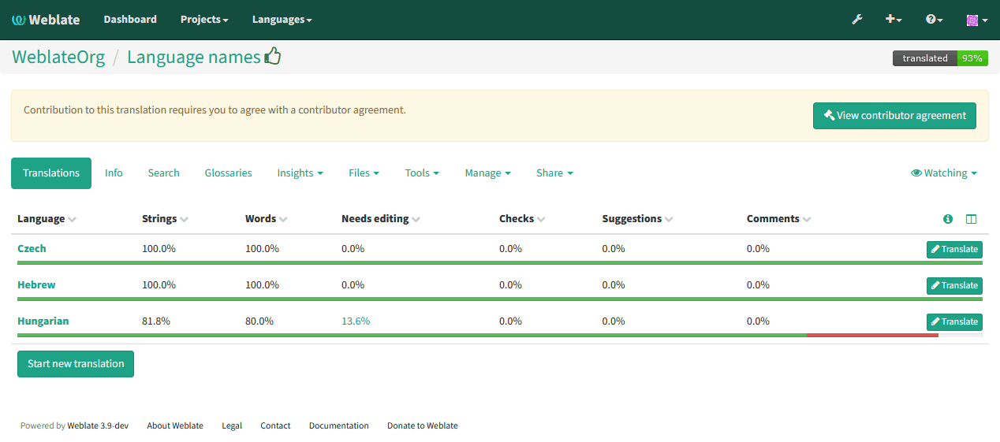

Licensing translations
======================

Weblate allows you to specify under which license the translations are
contributed. This is especially important to specify if the translations are
open to the public to raise proper expectations what can be done with the
translations. 

There are two things you specify on the :ref:`component` - license information
and the contributor agreement.

License information
-------------------

Upon specifying license information (license name and URL), this information is
shown in the translation information, but it is not enforced in any way.

Usually this is best location to place information on licensing where no
explicit consent is required.

Contributor agreement
---------------------

Once you specify contributor agreement, only users who have agreed to it will
be able to contribute. This is clearly visible when accessing the translation:

The entered text is formatted into paragraphs and external links are possible.
HTML markup can not be used.
