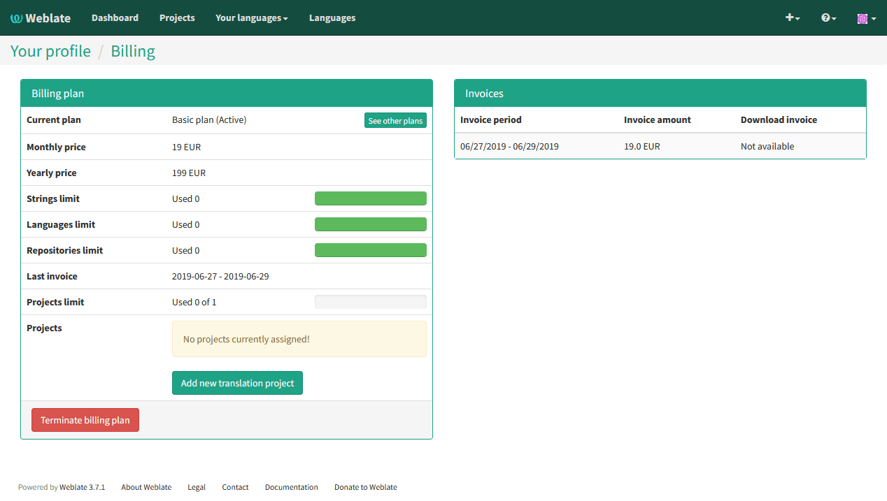
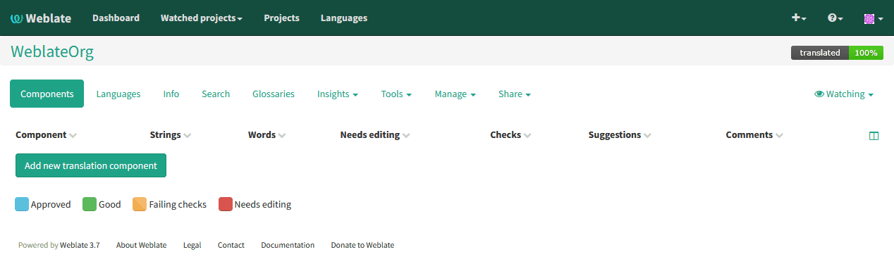
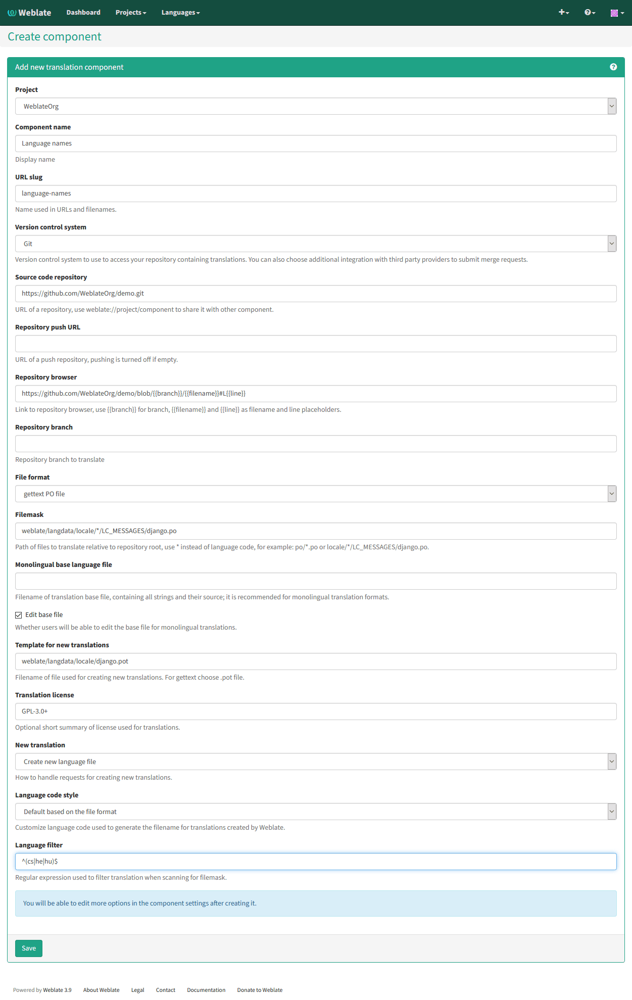

Translation projects
====================

Translation organization
------------------------

Weblate organizes translatable content into tree like structure. The toplevel
object is :ref:`project`, which should hold all translations which belong
together (for example translation of an application in several versions
and/or documentation). On the next level, there is :ref:`component`, which is
actually the component to translate. Here you define the VCS repository to use and
mask of files to translate. Below :ref:`component` there are individual
translations, which are handled automatically by Weblate as the translation
files (matching mask defined in :ref:`component`) appear in VCS repository.

All translation components need to be available as VCS repositories and are
organized as project/component structure.

Weblate supports wide range of translation formats (both bilingual and
monolingua) supported by translate toolkit, see :ref:`formats` for more
information.

.. note::

    You can share cloned VCS repositories using :ref:`internal-urls`. Using shared repositories feature is highly recommended when you have many components that use the same VCS. It will improve performance and use less disk space.

Adding translation projects and components
------------------------------------------

.. versionchanged:: 3.2

   Since the 3.2 release the interface for adding projects and components is
   included in Weblate and no longer requires you to use
   :ref:`admin-interface`.

Based on your permissions, you can be able to create new translation projects
and componets in Weblate. It is always allowed for superusers and if your
instance uses billing (eg. like https://hosted.weblate.org/), you can also
create those based on your plans allowance.

You can view your current billing plan on separate page:

The project creation can be intiated from there or using menu in navigation
bar. All you need to do then is to fill in basic information about the
translation project:

.. image:: ../images/user-add-project.png

After creating the project, you are directly taken to the project page:

Creating new translation component can be initiated by single click there and
you will have to fill in translation component information now:

.. seealso::

      :ref:`admin-interface`,
      :ref:`project`,
      :ref:`component`

.. _project:

Project configuration
---------------------

To add a new component to translate, you need to create a translation project first.
The project is a sort of shelf, in which real translations are folded. All
components in the same project share suggestions and the dictionary; also the
translations are automatically propagated through all components in a single
project (unless disabled in component configuration).

The project has only a few attributes giving translators information about
the project:

Project website
    URL where translators can find more information about the project.
Mailing list
    Mailing list where translators can discuss or comment on translations.
Translation instructions
    URL where you have more detailed instructions for translators.
Set Translation-Team header
    Whether Weblate should manage Translation-Team header (this is
    :ref:`gettext` only feature right now).
Use shared translation memory
    Whether to use shared translation memory, see :ref:`shared-tm` for more details.
Access control
    Configure per project access control, see :ref:`acl` for more details.
Enable reviews
    Enable review workflow, see :ref:`reviews`.
Enable hooks
    Whether unauthenticated :ref:`hooks` will be enabled for this repository.
Source language
    Language used for source strings in all components. Change this if you are 
    translating from something else than English.

.. note::

    Most of the fields can be edited by project owners or managers in the 
    Weblate interface.

Adjusting interaction
+++++++++++++++++++++

There are also additional features which you can control, like automatic
pushing of changes (see also :ref:`push-changes`) or
maintaining of Translation-Team header.

.. _component:

Component configuration
-----------------------

Component is real component for translating. You enter VCS repository location
and file mask for which files to translate and Weblate automatically fetches from the VCS
and finds all matching translatable files.

You can find some examples of typical configurations in the :ref:`formats`.

.. note::

    It is recommended to have translation components of reasonable size - split
    the translation by anything what makes sense in your case (individual
    applications or addons, book chapters or websites).

    Weblate easily handles translations with 10000 of units, but it is harder
    to split work and coordinate among translators with such a large translation.
    Also when one translator is working on a component, this translation is locked
    for others, see :ref:`locking`.

Should the language definition for translation be missing, an empty definition is
created and named as "cs_CZ (generated)". You should adjust the definition and
report this back to Weblate authors so that the missing language can be included in
next release.

The component contains all important parameters for working with VCS and
getting translations out of it:

Version control system
    VCS to use, see :ref:`vcs` for details.
Source code repository
    VCS repository used to pull changes, see :ref:`vcs-repos` for more details.
    
    This can be either a real VCS URL or ``weblate://project/component``
    indicating that the repository should be shared with another component.
    See :ref:`internal-urls` for more details.
Repository push URL
    Repository URL used for pushing, this is completely optional and push
    support will be disabled when this is empty. See :ref:`vcs-repos` for more
    details on how to specify repository URL.
Repository browser
    URL of repository browser to display source files (location where messages
    are used). When empty no such links will be generated.

    You can use following format strings:
        
    * ``%(branchs)s`` - current branch
    * ``%(line)s`` - line in file
    * ``%(file)s`` - filename
    * ``%(../file)s`` - filename in parent directory
    * ``%(../../file)s`` - filename in grandparent directory

    For example on GitHub, you would use something like
    ``https://github.com/WeblateOrg/hello/blob/%(branch)s/%(file)s#L%(line)s``.
Exported repository URL
    URL where changes made by Weblate are exported. This is important when
    :ref:`continuous-translation` is not used or when there is need to manually
    merge changes. You can use :ref:`git-exporter` to automate this for Git
    repositories.
Repository branch
    Which branch to checkout from the VCS and where to look for translations.
File mask
    Mask of files to translate including path. It should include one *
    replacing language code (see :ref:`languages` for information how this is 
    processed). In case your repository contains more than one translation
    files (eg. more Gettext domains), you need to create separate component for
    each.

    For example ``po/*.po`` or ``locale/*/LC_MESSAGES/django.po``.

    In case your filename contains special chars such as ``[``, ``]``, these need
    to be escaped as ``[[]`` or ``[]]``.
Monolingual base language file
    Base file containing strings definition for :ref:`monolingual`.
Edit base file
    Whether to allow editing of base file for :ref:`monolingual`.
Base file for new translations
    Base file used to generate new translations, eg. ``.pot`` file with Gettext,
    see :ref:`new-translations` for more information.
File format
    Translation file format, see also :ref:`formats`.
Source string bug report address
    Email address used for reporting upstream bugs. This address will also receive
    notification about any source string comments made in Weblate.
Locked
    You can lock the translation to prevent updates by users.
Allow translation propagation
    You can disable propagation of translations to this component from other
    components within same project. This really depends on what you are
    translating, sometimes it's desirable to have same string used.

    It's usually a good idea to disable this for monolingual translations unless
    you are using the same IDs across the whole project.
Save translation history
    Whether to store a history of translation changes in database.
Enable suggestions
    Whether translation suggestions are accepted for this component.
Suggestion voting
    Enable voting for suggestions, see :ref:`voting`.
Autoaccept suggestions
    Automatically accept voted suggestions, see :ref:`voting`.
Quality checks flags
    Additional flags to pass to quality checks, see :ref:`custom-checks`.
Translation license
    License of this translation.
License URL
    URL where users can find full text of a license.
New language
    How to handle requests for creating new languages. Please note that the
    availability of choices depends on the file format, see :ref:`formats`.
Merge style
    You can configure how the updates from the upstream repository are handled.
    This might not be supported for some VCS. See :ref:`merge-rebase` for
    more details.
Commit message
    Message used when committing translation, see :ref:`markup`.
Committer name
    Name of the committer used on Weblate commits, the author will be always the
    real translator. On some VCS this might be not supported. Default value
    can be changed by :setting:`DEFAULT_COMMITER_NAME`.
Committer email
    Email of committer used on Weblate commits, the author will be always the
    real translator. On some VCS this might be not supported. Default value
    can be changed by :setting:`DEFAULT_COMMITER_EMAIL`.
Push on commit
    Whether any committed changes should be automatically pushed to upstream
    repository.
Age of changes to commit
    Configures how old changes (in hours) will be committed by
    :djadmin:`commit_pending` management command (usually executed by cron).
    Default value can be changed by :setting:`COMMIT_PENDING_HOURS`.
Language filter
    Regular expression which is used to filter translation when scanning for
    file mask. This can be used to limit list of languages managed by Weblate
    (eg. ``^(cs|de|es)$`` will include only those there languages. Please note
    that you need to list language codes as they appear in the filename.

.. note::

    Most of the fields can be edited by project owners or managers in the 
    Weblate interface.

.. seealso:: 
   
   :ref:`faq-vcs`

.. _markup:

Template markup
---------------

Weblate uses simple markup language on several places where text rendering is
needed. It is based on :doc:`django:ref/templates/language` so it can be quite
powerful.

Currently it is used in:

* Commit message formatting, see :ref:`component`
* Several addons
    * :ref:`addon-weblate.discovery.discovery`
    * :ref:`addon-weblate.generate.generate`
    * :ref:`addon-script`

There are following variables available in the templates:

``{{ language_code }}``
    Language code
``{{ language_name }}``
    Language name
``{{ component_name }}``
    Component name
``{{ component_slug }}``
    Component slug
``{{ project_name }}``
    Project name
``{{ project_slug }}``
    Project slug
``{{ url }}``
    Translation URL
``{{ stats }}``
    Translation stats, this has futher attributes, see below for examples.
``{{ stats.all }}``
    Total strings count
``{{ stats.fuzzy }}``
    Count of strings needing review
``{{ stats.fuzzy_percent }}``
    Percent of strings needing review
``{{ stats.translated }}``
    Translated strings count
``{{ stats.translated_percent }}``
    Translated strings percent
``{{ stats.allchecks }}``
    Number of strings with failing check
``{{ stats.allchecks_percent }}``
    Percent of strings with failing check
``{{ author }}``
    Author of current commit, available only in the commit scope.

You can combine them with filters:

.. code-block:: django

    {{ component|title }}

You can use conditions:

.. code-block:: django

    Well translated!

There is addtional tag available to replace chars:

.. code-block:: django

    

You can combine it with filters:

.. code-block:: django

    

...and other Django template features.

.. _import-speed:

Importing speed
---------------

Fetching VCS repository and importing translations to Weblate can be a lengthy
process depending on size of your translations. Here are some tips to improve
this situation:

Clone Git repository in advance
+++++++++++++++++++++++++++++++

You can put in place a Git repository which will be used by Weblate. The
repositories are stored in :file:`vcs` directory in path defined by
:setting:`DATA_DIR` in :file:`settings.py` in :file:`<project>/<component>`
directories.

This can be especially useful if you already have local clone of this
repository and you can use ``--reference`` option while cloning:

.. code-block:: sh

    git clone \
        --reference /path/to/checkout \
        https://github.com/WeblateOrg/weblate.git \
        weblate/repos/project/component

Optimize configuration
++++++++++++++++++++++

The default configuration is useful for testing and debugging Weblate, while
for production setup, you should do some adjustments. Many of them have quite
a big impact on performance. Please check :ref:`production` for more details,
especially:

* :ref:`production-indexing`
* :ref:`production-cache`
* :ref:`production-database`
* :ref:`production-debug`

Disable not needed checks
+++++++++++++++++++++++++

Some quality checks can be quite expensive and if you don't need them, they
can save you some time during import. See :setting:`CHECK_LIST` for more
information how to configure this.

.. _autocreate:

Automatic creation of components
--------------------------------

In case you have project with dozen of translation files (eg. for different
Gettext domains or parts of Android apps), you might want to import them
automatically. This can be either achieved from command line using
:djadmin:`import_project` or :djadmin:`import_json` or by installing
:ref:`addon-weblate.discovery.discovery` addon.

For using the addon, you need to first create component for one translation
file (choose the one that is least likely to be renamed or removed in future)
and install the addon on this component.

For the management commans, you need to create a project which will contain all
components and then it's just a matter of running :djadmin:`import_project` or
:djadmin:`import_json`.

.. seealso:: 
   
   :ref:`manage`,
   :ref:`addon-weblate.discovery.discovery`

.. _fulltext:

Fulltext search
---------------

Fulltext search is based on Whoosh. It is processed in background if Celery is
configured.  This leads to a faster response of the site and less fragmented
index with the cost that it might be slightly outdated.

.. seealso:: 
   
   :ref:`faq-ft-slow`, :ref:`faq-ft-lock`, :ref:`faq-ft-space`
