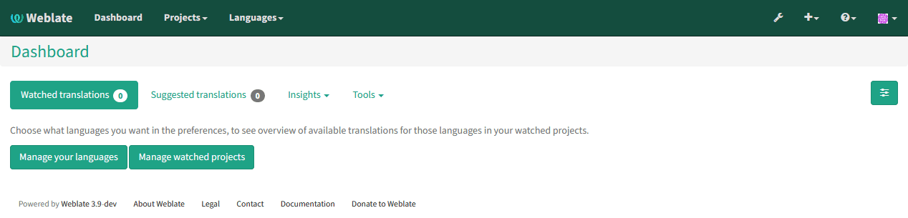
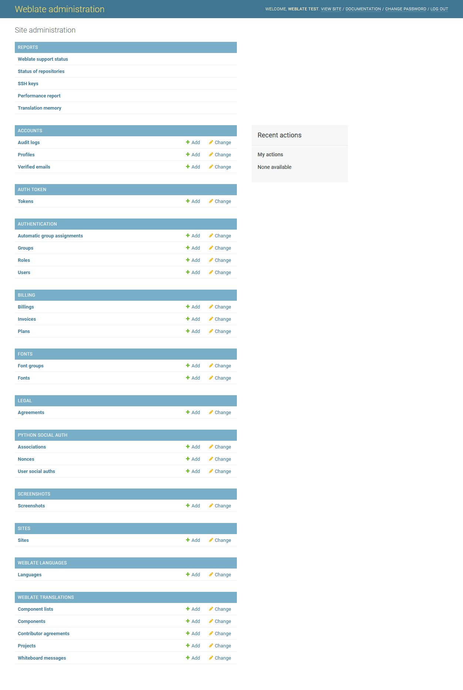
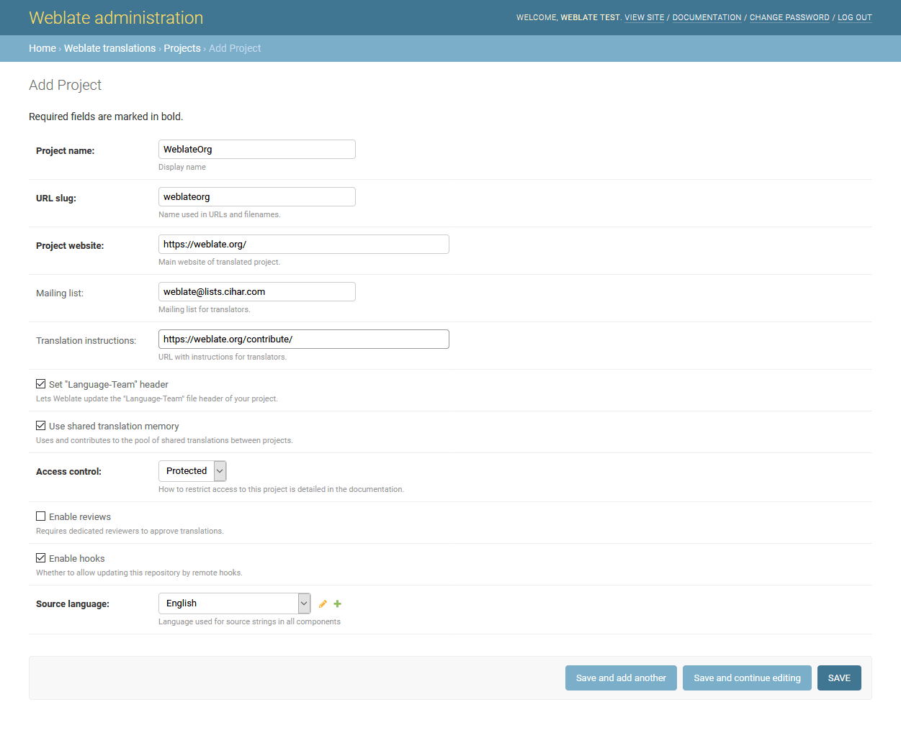
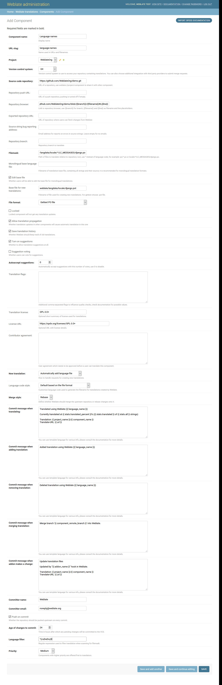
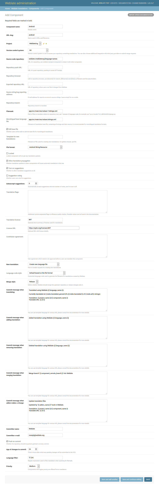

Translation projects
====================

Translation organization
------------------------

Weblate organizes translatable content into tree like structure. The toplevel
object is :ref:`project`, which should hold all translations which belong
together (for example translation of an application in several versions
and/or documentation). On the next level, there is :ref:`component`, which is
actually the component to translate. Here you define VCS repository to use and
mask of files to translate. Bellow :ref:`component` there are individual
translations, which are handled automatically by Weblate as the translation
files (matching mask defined in :ref:`component`) appear in VCS repository.

.. _admin-interface:

Administration
--------------

Administration of Weblate is done through standard Django admin interface,
which is available under :file:`/admin/` URL. Once logged in as user with
proper privileges, you can access it using wrench icon in top navigation:

Here you can manage objects stored in the database, such as users, translations
and other settings:

In the :guilabel:`Reports` section you can check status of your site, tweak
it for :ref:`production` or manage SSH keys to access :ref:`vcs-repos`.

All sections below you can manage database objects. The most interesting one is
probably :guilabel:`Weblate translations`, where you can manage translatable
projects, see :ref:`project` and :ref:`component`.

Another section, :guilabel:`Weblate languages` holds language defintions, see
:ref:`languages` for more details.

Adding new components
---------------------

All translation components need to be available as VCS repositories and are
organized as project/component structure.

Weblate supports wide range of translation formats (both bilingual and
monolingua) supported by translate toolkit, see :ref:`formats` for more
information.

Adding project
++++++++++++++

First you have to add project, which will serve as container for all
components. Usually you create one project for one piece of software or book
(see :ref:`project` for information on individual parameters):

.. seealso:: 
   
   :ref:`project`

.. _bilingual:

Bilingual components
++++++++++++++++++++

Once you have added a project, you can add translation compontents to it
(see :ref:`component` for information on individual parameters):

.. seealso:: 
   
   :ref:`component`

.. _monolingual:

Monolingual components
++++++++++++++++++++++

For easier translating of monolingual formats, you should provide template
file, which contains mapping of message IDs to source language (usually
English) (see :ref:`component` for information on individual parameters):

.. seealso:: 
   
   :ref:`component`

.. _project:

Project configuration
---------------------

To add new component to translate, you need to create translation project first.
The project is sort of shelf, in which real translations are folded. All
components in same project share suggestions and dictionary, also the
translations are automatically propagated through the all component in single
project (unless disabled in component configuration).

The project has only few attributes giving translators information about
project:

Project website
    URL where translators can find more information about the project.
Mailing list
    Mailing list where translators can discuss or comment translations.
Translation instructions
    URL where you have more detailed instructions for translators.
Push on commit
    Whether any committed changes should be automatically pushed to upstream
    repository.
Set Translation-Team header
    Whether Weblate should manage Translation-Team header (this is
    :ref:`gettext` only feature right now).
Enable ACL
    Enable per project access control, see :ref:`acl` for more details.
Enable hooks
    Whether unauthenticated :ref:`hooks` will be enabled for this repository.
Owners
    You can also configure project owners, who will always get important
    notifications about project and will have additional privileges to control
    translations within this project (see :ref:`privileges`).
Source language
    Language used for source strings in all components. Change this if you are 
    translating from something else than English.

Adjusting interaction
+++++++++++++++++++++

There are also additional features which you can control, like automatic
pushing of changes (see also :ref:`push-changes`) or
maintaining of Translation-Team header.

.. _component:

.. _subproject:

Component configuration
-----------------------

Component is real component for translating. You enter VCS repository location
and file mask which files to translate and Weblate automatically fetches the VCS
and finds all matching translatable files.

Should the language definition for translation be missing, empty definition is
created and named as "cs_CZ (generated)". You should adjust the definition and
report this back to Weblate authors so that missing language can be included in
next release.

The component contains all important parameters for working with VCS and
getting translations out of it:

Version control system
    VCS to use, see :ref:`vcs` for details.
Source code repository
    VCS repository used to pull changes, see :ref:`vcs-repos` for more details.
    
    This can be either real VCS URL or ``weblate://project/component``
    indicating that the repository should be shared with another component.
Repository push URL
    Repository URL used for pushing, this is completely optional and push
    support will be disabled when this is empty. See :ref:`vcs-repos` for more
    details on how to specify repository URL.
Repository browser
    URL of repository browser to display source files (location where messages
    are used). When empty no such links will be generated.

    For example on GitHub, you would use something like
    ``https://github.com/WeblateOrg/hello/blob/%(branch)s/%(file)s#L%(line)s``.
Exported repository URL
    URL where changes made by Weblate are exported. This is important when
    :ref:`continuous-translation` is not used or when there is need to manually
    merge changes.
Repository branch
    Which branch to checkout from the VCS and where to look for translations.
File mask
    Mask of files to translate including path. It should include one *
    replacing language code (see :ref:`languages` for information how this is 
    processed). In case your repository contains more than one translation
    files (eg. more Gettext domains), you need to create separate component for
    each.

    For example ``po/*.po`` or ``locale/*/LC_MESSAGES/django.po``.
Monolingual base language file
    Base file containing strings definition for :ref:`monolingual`.
Edit base file
    Whether to allow editing of base file for :ref:`monolingual`.
Base file for new translations
    Base file used to generate new translations, eg. ``.pot`` file with Gettext.
File format
    Translation file format, see also :ref:`formats`.
Source string bug report address
    Email address used for reporting upstream bugs. This address will also receive
    notification about any source string comments made in Weblate.
Locked
    You can lock the translation to prevent updates by users.
Allow translation propagation
    You can disable propagation of translations to this component from other
    components within same project. This really depends on what you are
    translating, sometimes it's desirable to have same string used.

    It's usually good idea to disable this for monolingual translations unless
    you are using same IDs across whole project.
Post-update script
    One of scripts defined in :setting:`POST_UPDATE_SCRIPTS` which is executed
    after receiving update. This can be used to update the translation files.
Pre-commit script
    One of scripts defined in :setting:`PRE_COMMIT_SCRIPTS` which is executed
    before commit. This can be used to generate some metadata about translation
    or to generate binary form of a translation.
Post-commit script
    One of scripts defined in :setting:`POST_COMMIT_SCRIPTS` which is executed
    after commit. This can be used to notify external parties about the change.
Post-push script
    One of scripts defined in :setting:`POST_PUSH_SCRIPTS` which is executed
    after push to remote repository. This can be used to generate notify external
    parties about the change in repository (i.e. create pull request).
Post-add script
    One of scripts defined in :setting:`POST_ADD_SCRIPTS` which is executed
    when new translation has been added. This can be used to adjust additional
    files in the repository when adding new translation.
Additional commit files
    Additional files to include in the commit (separated by newline), usually
    this one is generated by the pre commit or post add scripts described
    above.

    Supply the ``%(language)s`` in the path like this:
    ``path/to/addditinal/%(language)s_file.example``
Save translation history
    Whether to store history of translation changes in database.
Suggestion voting
    Enable voting for suggestions, see :ref:`voting`.
Autoaccept suggestions
    Automatically accept voted suggestions, see :ref:`voting`.
Quality checks flags
    Additional flags to pass to quality checks, see :ref:`custom-checks`.
Translation license
    License of this translation.
License URL
    URL where users can find full text of a license.
New language
    How to handle requests for creating new languages. Please note that
    availability of choices depends on the file format, see :ref:`formats`.
Merge style
    You can configure how the updates from upstream repository are handled.
    This might not be supported for some VCS. See :ref:`merge-rebase` for
    more details.
Commit message
    Message used when committing translation, see :ref:`commit-message`.
Committer name
    Name of commiter used on Weblate commits, the author will be always the
    real translator. On some VCS this might be not supported. Default value
    can be changed by :setting:`DEFAULT_COMMITER_NAME`.
Committer email
    Email of commiter used on Weblate commits, the author will be always the
    real translator. On some VCS this might be not supported. Default value
    can be changed by :setting:`DEFAULT_COMMITER_EMAIL`.
Language filter
    Regular expression which is used to filter translation when scanning for
    file mask. This can be used to limit list of languages managed by Weblate
    (eg. ``^(cs|de|es)$`` will include only those there languages. Please note
    that you need to list language codes as they appear in the filename.

.. _commit-message:

Commit message formatting
+++++++++++++++++++++++++

The commit message on each commit Weblate does, it can use following format
strings in the message:

``%(language)s``
    Language code
``%(language_name)s``
    Language name
``%(component)s``
    Component name
``%(project)s``
    Project name
``%(total)s``
    Total strings count
``%(fuzzy)s``
    Count of strings needing review
``%(fuzzy_percent)s``
    Percent of strings needing review
``%(translated)s``
    Translated strings count
``%(translated_percent)s``
    Translated strings percent

.. seealso:: 
   
   :ref:`faq-vcs`, :ref:`processing`

.. _import-speed:

Importing speed
---------------

Fetching VCS repository and importing translations to Weblate can be lengthy
process depending on size of your translations. Here are some tips to improve
this situation:

Clone Git repository in advance
+++++++++++++++++++++++++++++++

You can put in place Git repository which will be used by Weblate. The
repositories are stored in :file:`vcs` directory in path defined by
:setting:`DATA_DIR` in :file:`settings.py` in :file:`<project>/<component>`
directories.

This can be especially useful if you already have local clone of this
repository and you can use ``--reference`` option while cloning:

.. code-block:: sh

    git clone \
        --reference /path/to/checkout \
        https://github.com/nijel/weblate.git \
        weblate/repos/project/component

Optimize configuration
++++++++++++++++++++++

The default configuration is useful for testing and debugging Weblate, while
for production setup, you should do some adjustments. Many of them have quite
big impact on performance. Please check :ref:`production` for more details,
especially:

* :ref:`production-indexing`
* :ref:`production-cache`
* :ref:`production-database`
* :ref:`production-debug`

Disable not needed checks
+++++++++++++++++++++++++

Some quality checks can be quite expensive and if you don't need them, they
can save you some time during import. See :setting:`CHECK_LIST` for more
information how to configure this.

.. _autocreate:

Automatic creation of components
--------------------------------

In case you have project with dozen of po files, you might want to import all
at once. This can be achieved using :djadmin:`import_project` or
:djadmin:`import_json`.

First you need to create project which will contain all components and then
it's just a matter of running :djadmin:`import_project` or
:djadmin:`import_json`.

.. seealso:: 
   
   :ref:`manage`

.. _fulltext:

Fulltext search
---------------

Fulltext search is based on Whoosh. You can either allow Weblate to directly
update index on every change to content or offload this to separate process by
:setting:`OFFLOAD_INDEXING`.

The first approach (immediate updates) allows more up to date index, but
suffers locking issues in some setup (eg. Apache's mod_wsgi) and produces more
fragmented index.

Offloaded indexing is always better choice for production setup - it only marks
which items need to be reindexed and you need to schedule background process
(:djadmin:`update_index`) to update index. This leads to faster response of the
site and less fragmented index with cost that it might be slightly outdated.

.. seealso:: 
   
   :djadmin:`update_index`, :setting:`OFFLOAD_INDEXING`, :ref:`faq-ft-slow`, :ref:`faq-ft-lock`, :ref:`faq-ft-space`
