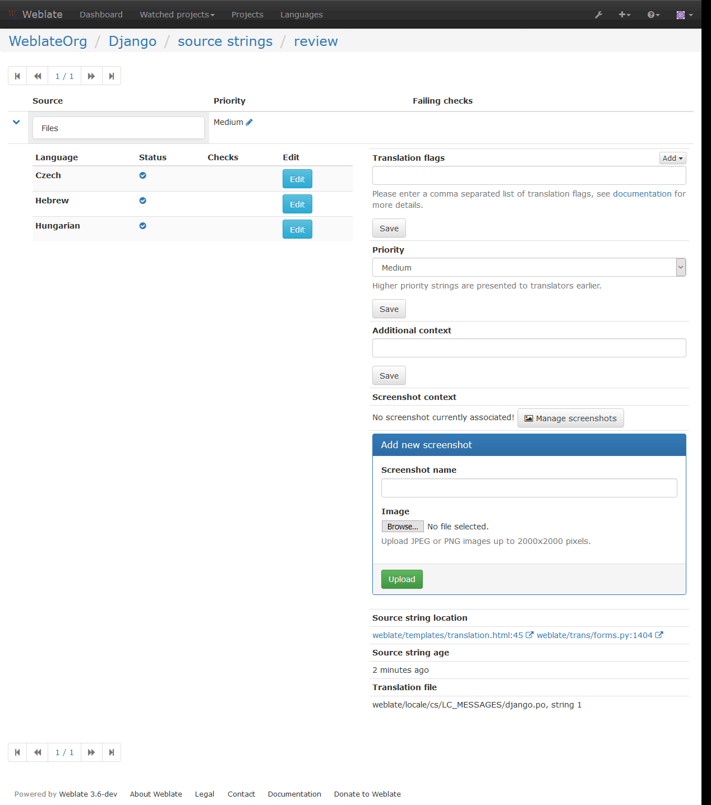
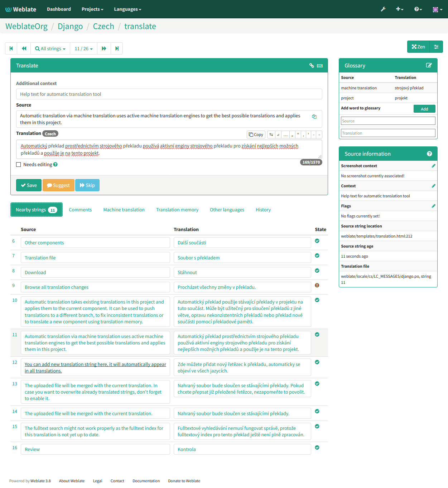
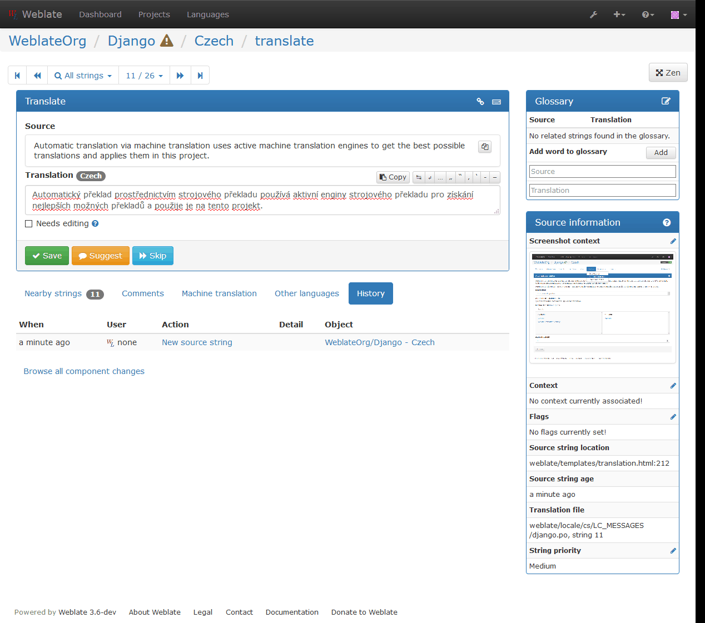
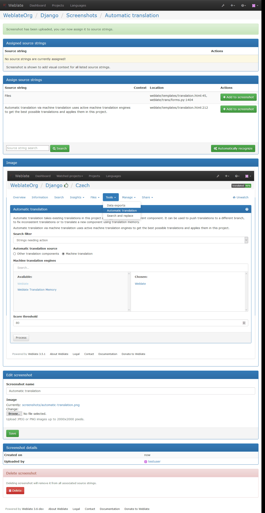

Translation process
===================

.. _voting:

Suggestion voting
-----------------

.. versionadded:: 1.6

    This feature is available since Weblate 1.6.

In default Weblate setup, everybody can add suggestions and logged in users can
accept them. You might however want to have more eyes on the translation and
require more people to accept them. This can be achieved by suggestion voting.
You can enable this on :ref:`component` configuration by
:guilabel:`Suggestion voting` and :guilabel:`Autoaccept suggestions`. The first
one enables voting feature, while the latter allows you to configure threshold
at which suggestion will gets automatically accepted (this includes own vote from
suggesting user).

.. note::

    Once you enable automatic accepting, normal users lose privilege to
    directly save translations or accept suggestions. This can be overriden
    by :guilabel:`Can override suggestion state` privilege
    (see :ref:`privileges`).

You can combine these with :ref:`privileges` into one of following setups:

* Users can suggest and vote for suggestions, limited group controls what is
  accepted - enable voting but not automatic accepting and remove privilege
  from users to save translations.
* Users can suggest and vote for suggestions, which get automatically accepted
  once defined number of users agree on this - enable voting and set desired
  number of votes for automatic accepting.
* Optional voting for suggestions - you can also only enable voting and in
  this case it can be optionally used by users when they are not sure about
  translation (they can suggest more of them).

.. _locking:

Translation locking
-------------------

To improve collaboration, it is good to prevent duplicate effort on
translation. To achieve this, translation can be locked for single translator.
This can be either done manually on translation page or is done automatically
when somebody starts to work on translation. The automatic locking needs to be
enabled using :setting:`AUTO_LOCK`.

The automatic lock is valid for :setting:`AUTO_LOCK_TIME` seconds and is
automatically extended on every translation made and while user has opened
translation page.

User can also explicitly lock translation for :setting:`LOCK_TIME` seconds.

.. _additional:

Additional information on source strings
----------------------------------------

Weblate allows you to enhance translation process with information 
available in the translation files. This includes strings prioritization, check
flags or providing visual context. All these features can be set on the
:ref:`source-review`:

You can access this also directly from translating interface when clicking on the 
edit icon next to :guilabel:`Screenshot context`, :guilabel:`Flags`
or :guilabel:`String priority`:

Strings prioritization
++++++++++++++++++++++

.. versionadded:: 2.0

You can change string priority, strings with higher priority are offered first
for translation. This can be useful for prioritizing translation of strings
which are seen first by users or are otherwise important.

Quaity check flags
++++++++++++++++++

.. versionadded:: 2.4

Default set of quality check flags is determined from the translation
:ref:`component` and the translation file. However you might want to customize
this per source string and you have the option here.

.. seealso:: :ref:`checks`

.. _screenshots:

Visual context for strings
++++++++++++++++++++++++++

.. versionadded:: 2.9

You can upload screenshot showing usage of given source string within your
application. This can help translators to understand where it is used and how
it should be translated.

Uploaded screenshot is shown in the translation context sidebar:

In addition to :ref:`source-review`, screenshots have separate management
interface. You can find it under :guilabel:`Tools` menu. This allows you 
to upload screenshots, assign them to source strings manually or using OCR.

Once screenshot is uploaded, you will be presented following interface to
manage it and assign to source strings:

