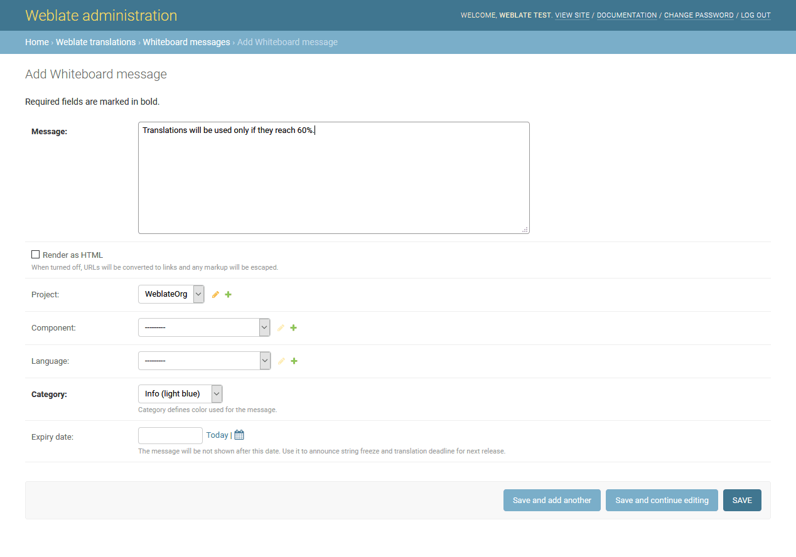
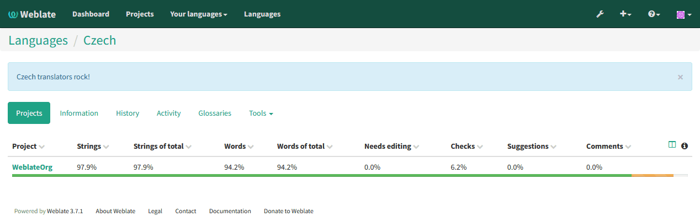
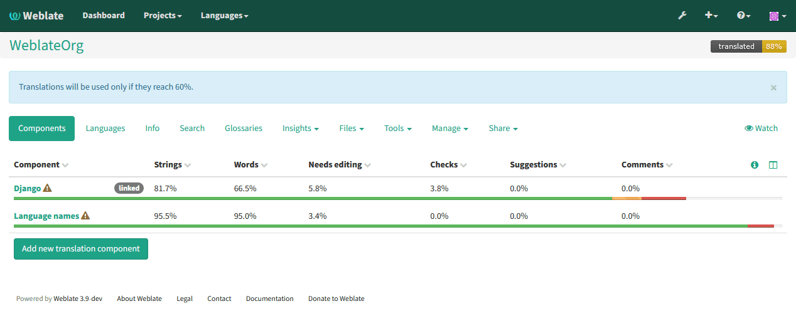

Whiteboard messages
===================

You can use whiteboard messages to give some information to your translators.
The message can be site-wide or targeted on translation component or language.

This can be useful for various things from announcing purpose of the website to
specifying targets for translations.

The whiteboard can currently be specified only in the admin interface:

The whiteboard messages are then shown based on specified context:

No context specified
    
    Shown on dashboard (landing page).

Project specified

    Shown on project, all its components and translations.

Component specified

    Shown on component and all its translations.

Language specified

    Shown on language overview and all translations in this language.

You can see how it looks on the language overview page:

And on the project page:

