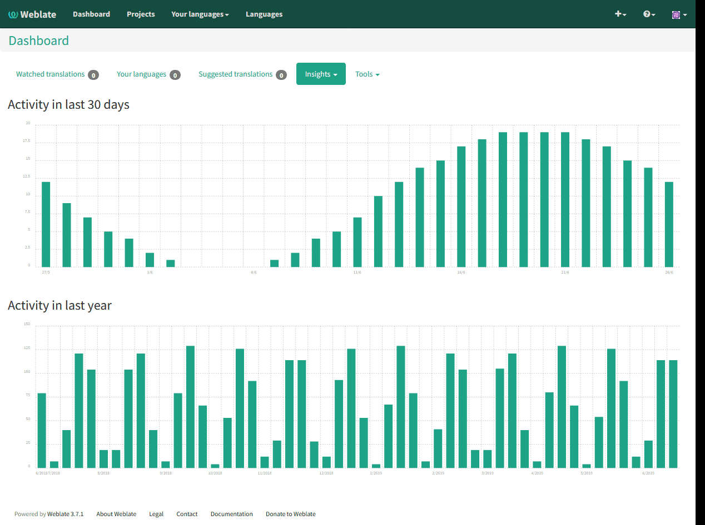
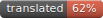
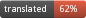
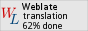
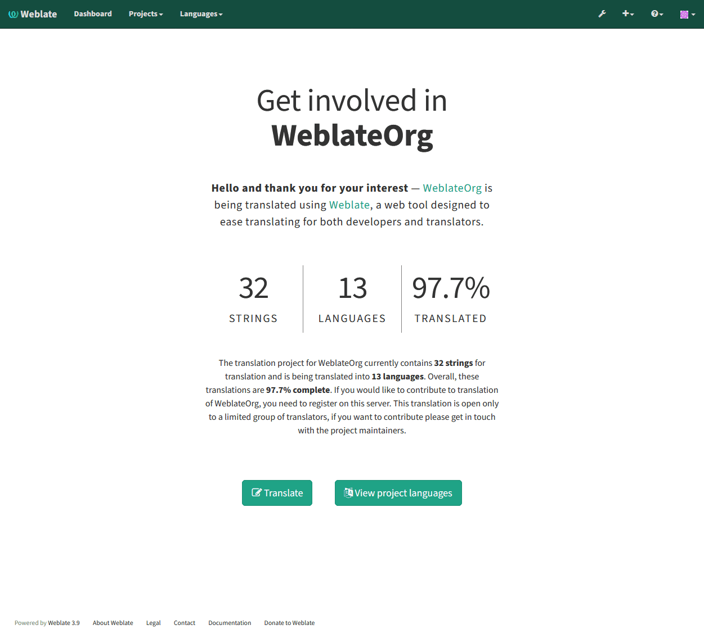

Application developer guide
===========================

Using Weblate for translating your projects can bring you quite a lot of
benefits. It's only up to you how much of that you will use.

.. _reports:

Activity reports
----------------

You can check activity reports for translations, project or individual users.

.. _promotion:

Promoting the translation
-------------------------

Weblate provides you widgets to share on your website or other sources to
promote the translation project. It also has a nice welcome page for new contributors
to give them basic information about the translation. Additionally you can
share information about translation using Facebook or Twitter. All these
possibilities can be found on the :guilabel:`Share` tab. Example of status badges
for Weblate itself are show below.

Shields.IO badge often used to quickly see status of a project:

Small badge often used to quickly see status of a project:

Big badge with status details useful for inclusion on a web page:

Small badge with status useful for inclusion on a web page:

All these badges come with links to simple page which explains users how to
translate using Weblate:

Reviewing source strings
------------------------

Source strings checks
+++++++++++++++++++++

Weblate includes quite a lot of :ref:`checks`. Some of them also focus on
quality of source strings. These can give you some hints for making strings
easier to translate. You can check failing source checks on :guilabel:`Source`
tab of every component.

Failing checks on translation
+++++++++++++++++++++++++++++

On the other side, failing translation checks might also indicate problem in
the source strings. Translators often tend to fix some mistakes in translation
instead of reporting it - typical example is missing full stop at the end of
sentence, but there are more such cases.

Reviewing all failing checks on your translation can bring you valuable
feedback for improving source strings as well.

String comments
+++++++++++++++

Weblate allows translators to comment on both translation and source strings.
Each :ref:`component` can be configured to receive such comments on email
address and sending this to developers mailing list is usually best approach.
This way you can monitor when translators find problems and fix them quickly.
