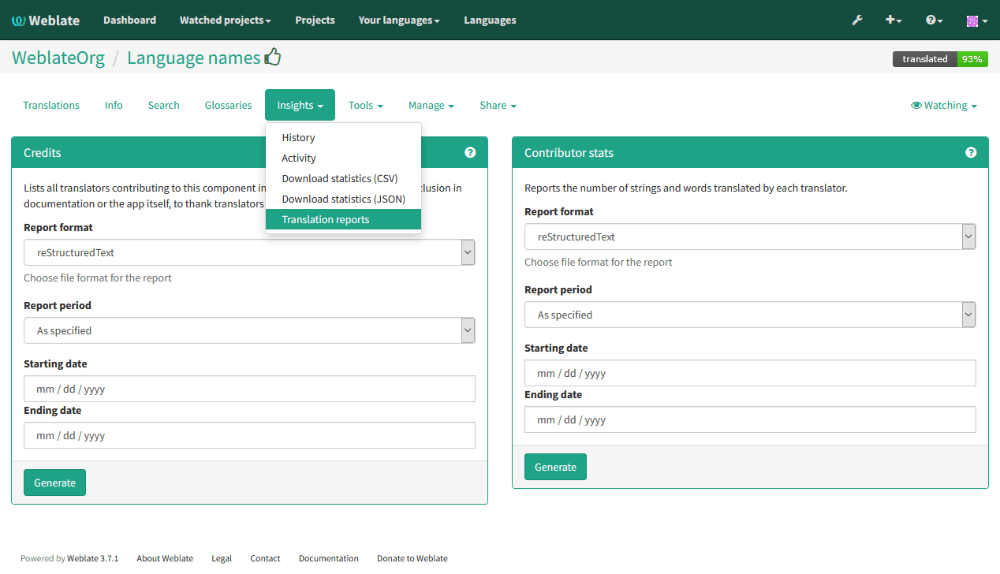

Translation progress reporting
==============================

It is often useful to be able to see how translation progresses over given
period. For this purpose Weblate includes reporting features, where you can
obtain summaries of contributions to given component over time. You can find
the reporting tool in the :guilabel:`Tools` menu for a translation component:

    
Several reporting tools are available on this page and all can produce output
in HTML, reStructuredText or JSON. The first two formats are suitable for
embedding into existing documentation, while JSON is useful for further
processing of the data.

Translator credits
------------------

Generates document usable for crediting translators - sorted by language
and listing all contributors to given language:

.. code-block:: rst

    * Czech

        * Michal Čihař <michal@cihar.com>
        * Weblate Admin <admin@example.com>

    * Dutch

        * Weblate Admin <admin@example.com>

And it will get rendered as:

    * Czech

        * Michal Čihař <michal@cihar.com>
        * Weblate Admin <admin@example.com>

    * Dutch

        * Weblate Admin <admin@example.com>

Contributor stats
-----------------

Generates number of words and units translated by translators:

.. code-block:: rst

    ======================================== ======================================== ========== ==========
    Name                                     Email                                    Words      Count     
    ======================================== ======================================== ========== ==========
    Michal Čihař                             michal@cihar.com                               2332        421 
    Weblate Admin                            admin@example.com                                25          8 
    ======================================== ======================================== ========== ==========

And it will get rendered as:

    ======================================== ======================================== ========== ==========
    Name                                     Email                                    Words      Count     
    ======================================== ======================================== ========== ==========
    Michal Čihař                             michal@cihar.com                               2332        421 
    Weblate Admin                            admin@example.com                                25          8 
    ======================================== ======================================== ========== ==========
