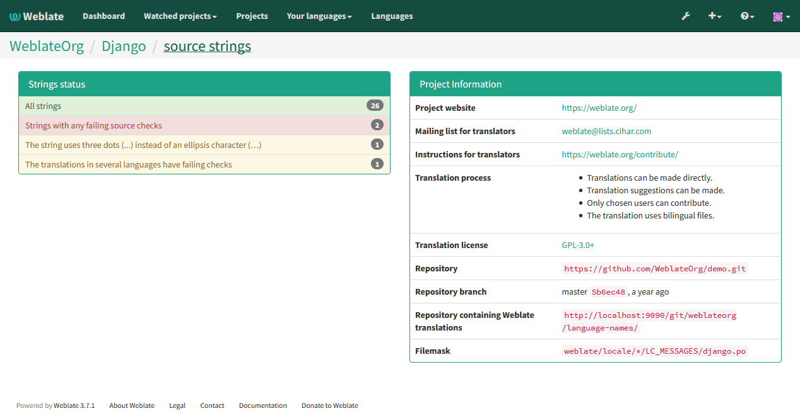
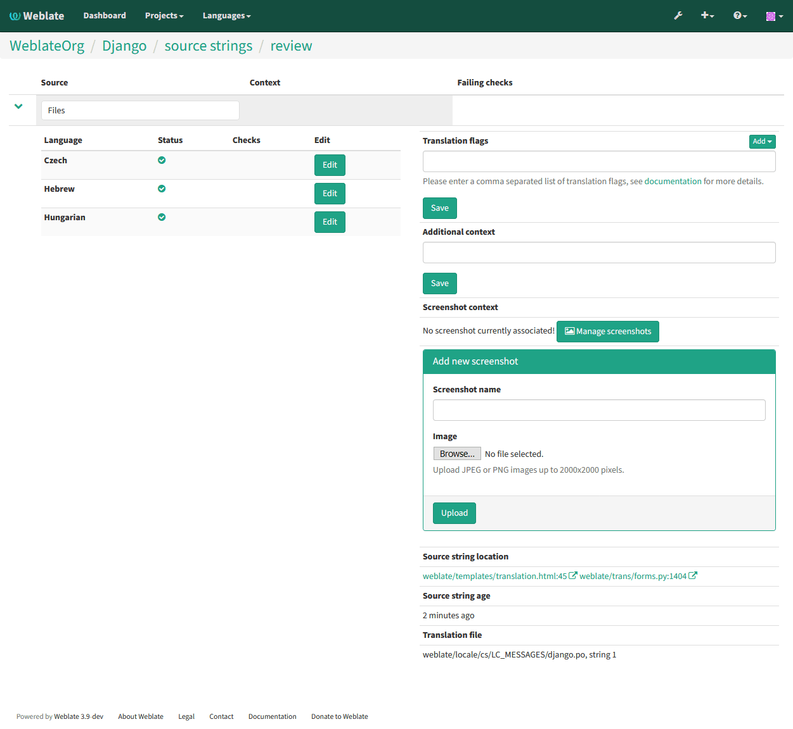

.. _source-review:

Reviewing source strings
========================

.. _reports:

Activity reports
----------------

You can check activity reports for translations, project or individual users.

.. image:: ../images/activity.png

Source strings checks
---------------------

Weblate includes quite a lot of :ref:`checks`. Some of them also focus on
quality of source strings. These can give you some hints for making strings
easier to translate. You can check failing source checks on :guilabel:`Source`
tab of every component.

Failing checks on translation
-----------------------------

On the other side, failing translation checks might also indicate problem in
the source strings. Translators often tend to fix some mistakes in translation
instead of reporting it - typical example is missing full stop at the end of
sentence, but there are more such cases.

Reviewing all failing checks on your translation can bring you valuable
feedback for improving source strings as well.

You can find the :guilabel:`Source strings review` in the :guilabel:`Tools`
menu of a translation component. You will get similar view when opening
translation, with slightly different checks being displayed:

One of the most interesting check here is the :ref:`check-multiple-failures` -
it fires whenever there is failure on multiple translations of given string.
Usually this is something to look for as this is string where translators have
problems doing the translation properly. It might be just wrong punctation at
the end of sentence or something more problematic.

The detailed listing then shows you overview per language:

String comments
---------------

Weblate allows translators to comment on both translation and source strings.
Each :ref:`component` can be configured to receive such comments on email
address and sending this to developers mailing list is usually best approach.
This way you can monitor when translators find problems and fix them quickly.

