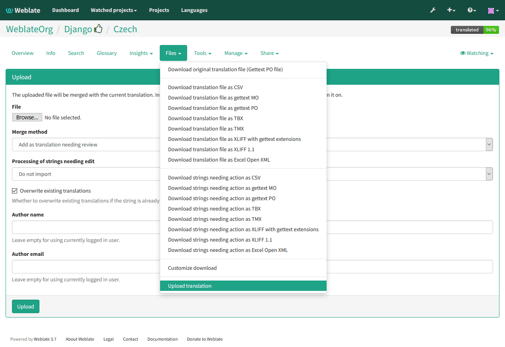

Downloading and uploading translations
======================================

Weblate supports both export and import of translation files. This allows you
to work offline and then merge changes back. Your changes will be merged within
existing translation (even if it has been changed meanwhile).

.. note::

    This available options might be limited by :ref:`privileges`.

Downloading translations
------------------------

You can download translatable file using the :guilabel:`Download source file`
action in the :guilabel:`Files` menu. This will give you the file as is stored
in upstream version control system.

For some formats you can also download compiled file to use withing application
(for example ``.mo`` files for GNU Gettext) using the 
:guilabel:`Download compiled translation`.

Uploading translations
----------------------

You can upload translated files using the :guilabel:`Upload translation` action
in the :guilabel:`Files` menu.

Weblate accepts any file format it understands on upload, but it is still
recommeded to use same file format as is used for translation, otherwise some
features might not be translated properly.

.. seealso:: 
   
   :ref:`formats`

The uploaded file is merged to current translation, overwriting existing
entries by default (this can be changed in the upload dialog).

Import methods
++++++++++++++

You can choose how imported strings will be merged out of following options:

Add as translation
    Imported translations are added as translation. This is most usual and
    default behavior.
Add as a suggestion
    Imported translations are added as suggestions, do this when you want to
    review imported strings.
Add as translation needing review
    Imported translations are added as translations needing review. This can be useful
    for review as well.

Additionally, when adding as a translation, you can choose whether to overwrite
already translated strings or not or how to handle strings needing review in imported
file.

