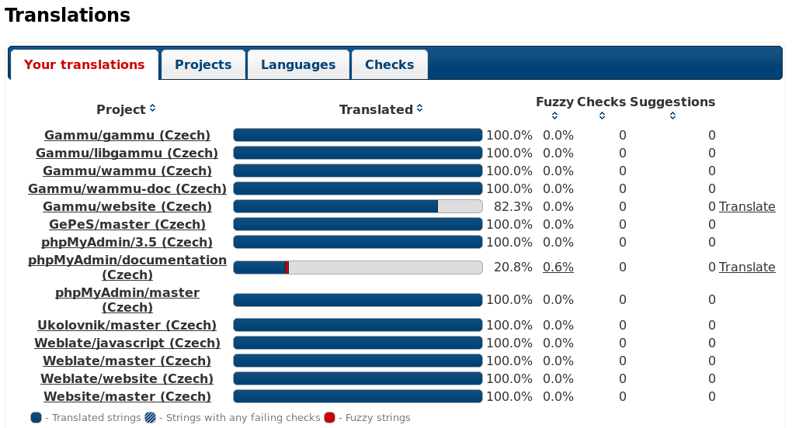
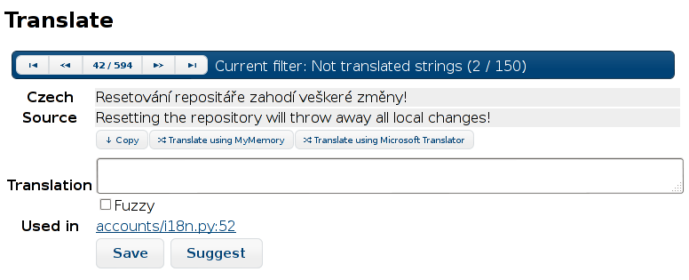
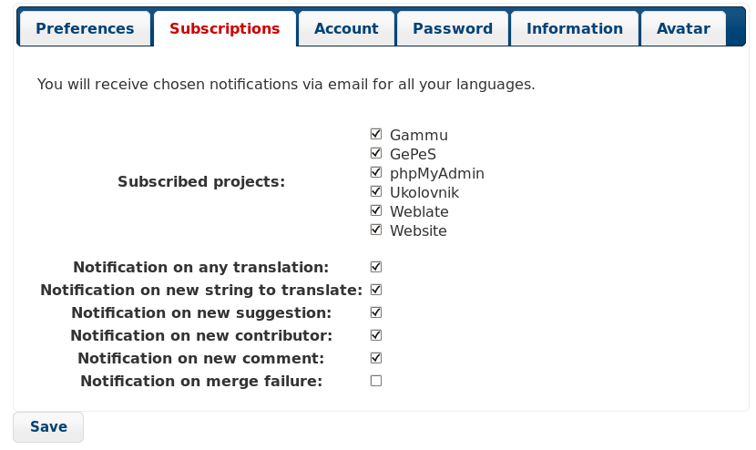

Registration and user profile
=============================

Registration
------------

While everybody can browse projects, view translations or suggest them, only
registered users are allowed to actually save changes and are credited for
every translation made.

You can register following two simple steps:

1. Fill out the registration form with your credentials
2. Activate registration by following in email you receive
3. Possibly adjust your profile to choose which languages you know

User profile
------------

User profile contains your preferences, name and email. Name and email
are being used in Git commits, so keep this information accurate.

Languages
+++++++++

Choose here which languages you prefer to translate. These will be offered to
you on main page to have easier access to translations.

Secondary languages
+++++++++++++++++++

You can define secondary languages, which will be shown you while translating
together with source language. Example can be seen on following image, where
Czech language is shown as secondary:

.. _subscriptions:

Subscriptions
+++++++++++++

You can subscribe to various notifications on :guilabel:`Subscriptions` tab.
You will receive notifications for selected events on chosen projects for
languages you have indicated for translation (see above).

