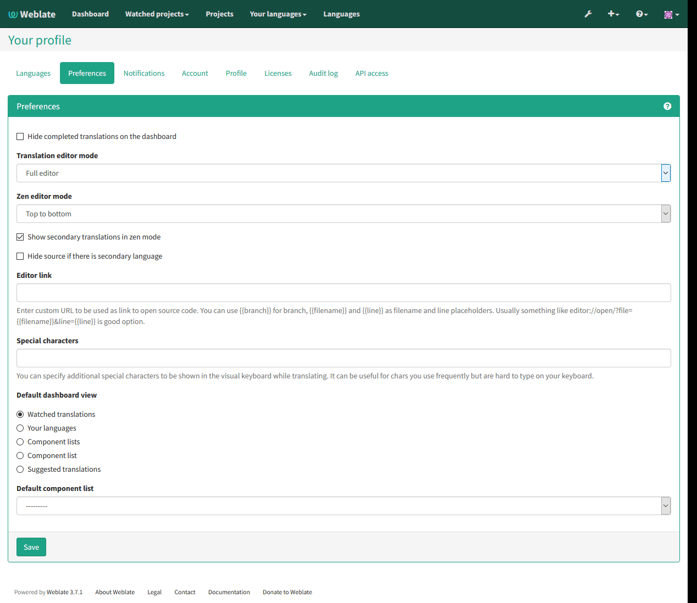

Registration and user profile
=============================

Registration
------------

While everybody can browse projects, view translations or suggest them, only
registered users are allowed to actually save changes and are credited for
every translation made.

You can register following two simple steps:

1. Fill out the registration form with your credentials
2. Activate registration by following in email you receive
3. Possibly adjust your profile to choose which languages you know

.. _dashboard:

Dashboard
---------

When you log in to Weblate, you will see an overview of projects and components
and their translation progress.

.. versionadded:: 2.5

By default, this will show the components of projects you are subscribed to,
cross-referenced with your preferred languages.  You can switch to different
views using the drop-down menu on the highlighted button.

The drop-down will have several options:

- :guilabel:`All projects` will show translation status of all projects on the
  Weblate instance.
- :guilabel:`Your languages` will show translation status of all projects,
  filtered by your primary languages.
- :guilabel:`Your subscriptions` will show translation status of only those
  projects you are subscribed to, filtered by your primary languages.

In addition, the drop-down can also show any number of *component lists*, sets
of project components preconfigured by the Weblate administrator.

You can configure your preferred view in the :guilabel:`Preferences` section of
your user profile settings.

User profile
------------

User profile contains your preferences, name and email. Name and email
are being used in VCS commits, so keep this information accurate.

Translated languages
++++++++++++++++++++

Choose here which languages you prefer to translate. These will be offered to
you on main page to have easier access to translations.

.. image:: ../images/your-translations.png

.. _secondary-languages:

Secondary languages
+++++++++++++++++++

You can define secondary languages, which will be shown you while translating
together with source language. Example can be seen on following image, where
Slovak language is shown as secondary:

.. image:: ../images/secondary-language.png

Default dashboard view
++++++++++++++++++++++

On the :guilabel:`Preferences` tab, you can pick which of the available
dashboard views will be displayed by default. If you pick :guilabel:`Component
list`, you have to select which component list will be displayed from the
:guilabel:`Default component list` drop-down.

.. _subscriptions:

Subscriptions
+++++++++++++

You can subscribe to various notifications on :guilabel:`Subscriptions` tab.
You will receive notifications for selected events on chosen projects for
languages you have indicated for translation (see above).

If you are an owner of some project, you will always receive some important
notifications, like merge failures or new language requests.

.. note::

    You will not receive notifications for actions you've done.

.. image:: ../images/profile-subscriptions.png

Authentication
++++++++++++++

On the :guilabel:`Authentication` tab you can connect various services which
you can use to login into Weblate. List of services depends on Weblate
configuration, but can include popular sites such as Google, Facebook, GitHub
or Bitbucket.

.. image:: ../images/authentication.png

Avatar
++++++

Weblate can be configured to show avatar for each user (depending on
:setting:`ENABLE_AVATARS`). These images are obtained using libravatar protocol
(see https://www.libravatar.org/) or using http://gravatar.com/.
