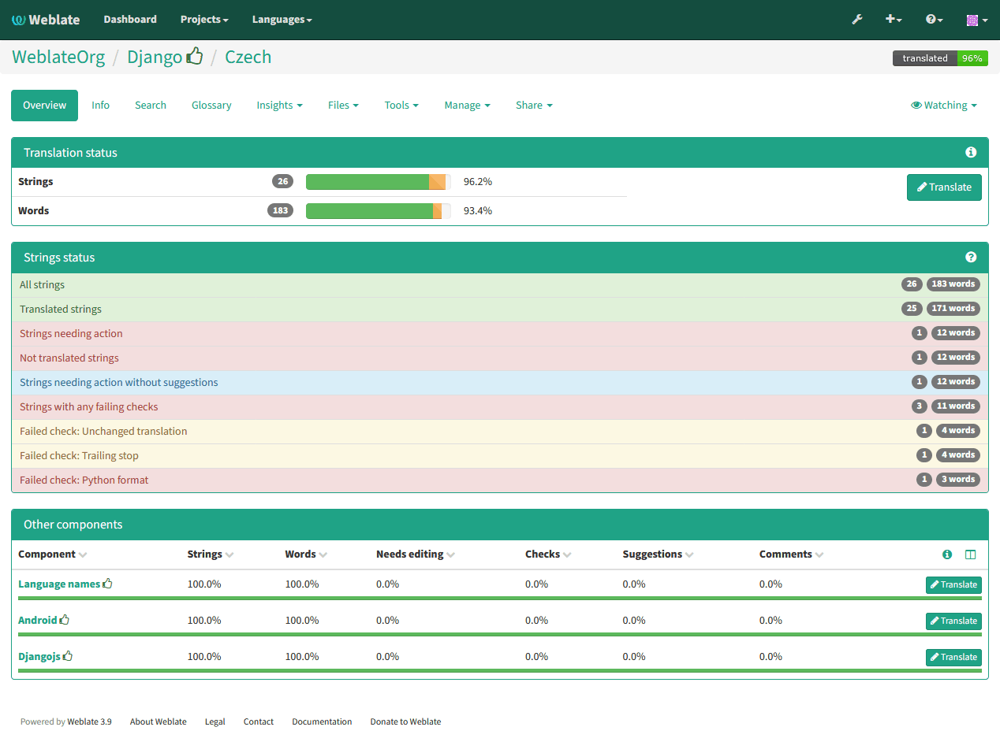
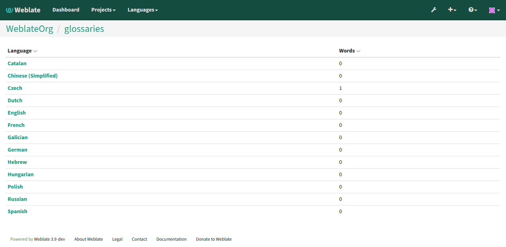
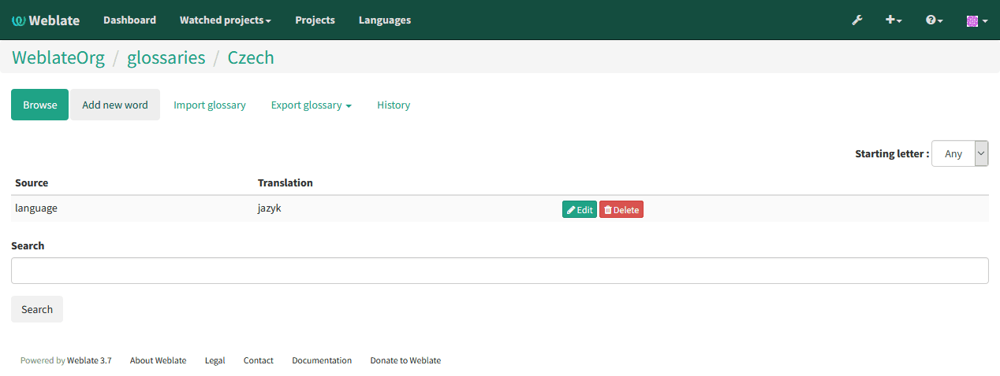
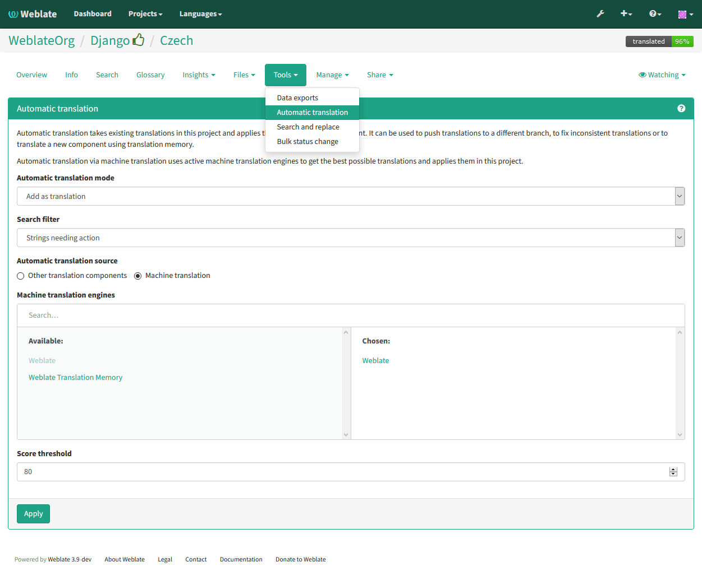

Translating using Weblate
=========================

Translation links
-----------------

Once you navigate to a translation, you will be shown set of links which lead
to translation. These are results of various checks, like untranslated or
strings needing review. Should no other checks fire, there will be still link
to all translations. Alternatively you can use search field to find translation
you need to fix.

Suggestions
-----------

As an anonymous user, you have no other choice than making a suggestion.
However if you are logged in you can still decide to make only a suggestion
instead of saving translation, for example in case you are unsure about the
translation and you want somebody else to review it.

.. note::

    Permissions might vary depending on your setup, what is described is
    default Weblate behaviour.

Translating
-----------

On translate page, you are shown source string and edit area for translating.
Should the translation be plural, multiple source strings and edit areas are
shown, each described with label for plural form.

Any special whitespace chars are underlined in red and indicated with grey
symbols. Also more than one space is underlined in red to allow translator to
keep formatting.

There are various extra information which can be shown on this page. Most of
them are coming from the project source code (like context, comments or where
the message is being used). When you configure secondary languages in your
preferences, translation to these languages will be shown (see 
:ref:`secondary-languages`).

Bellow translation can be also shown suggestions from other users, which you
can accept or delete.

.. _plurals:

Plurals
+++++++

What are plurals? Generally spoken plurals are words which take into account
numeric meanings. But as you may imagine each language has its own definition
of plurals. English, for example, supports one plural. We have a singular
definition, for example "car", which means implicit one car, and we have the
plural definition, "cars" which could mean more than one car but also zero
cars. Other languages like Czech or Arabic have more plurals and also the
rules for plurals are different.

Weblate does have support for translating these and offers you one field to
translate every plural separately. The number of fields and how it is used in
the translated application depends on plural equation which is different for
every language. Weblate shows the basic information, but you can find more
detailed description in the `Language Plural Rules`_ from the Unicode
Consortium.

.. _Language Plural Rules: http://unicode.org/repos/cldr-tmp/trunk/diff/supplemental/language_plural_rules.html

.. image:: ../images/plurals.png

Keyboard shortcuts
++++++++++++++++++

While translating you can use following keyboard shortcuts:

:kbd:`Alt+Home`
    Navigates to first translation in current search.
:kbd:`Alt+End`
    Navigates to last translation in current search.
:kbd:`Alt+PageUp`
    Navigates to previous translation in current search.
:kbd:`Alt+PageDown`
    Navigates to next translation in current search.
:kbd:`Alt+Enter` or :kbd:`Ctrl+Enter` or :kbd:`Command+Enter`
    Saves current translation.
:kbd:`Ctrl+Shift+Enter` or :kbd:`Command+Shift+Enter`
    Umarks translation as fuzzy and submits it.
:kbd:`Alt+E`
    Focus translation editor.
:kbd:`Alt+C`
    Focus comment editor.
:kbd:`Alt+M`
    Shows machine translation tab.
:kbd:`Alt+<NUMBER>`
    Copies placeable of given number from source string.
:kbd:`Alt+M <NUMBER>`
    Copy machine translation of given number to current translation.
:kbd:`Alt+I <NUMBER>`
    Ignore failing check of given number.
:kbd:`Alt+N`
    Shows nearby strings tab.
:kbd:`Alt+S`
    Shows search tab.
:kbd:`Alt+V`
    Copies source string
:kbd:`Alt+F`
    Toggles fuzzy flag.

Translation context
+++++++++++++++++++

Translation context part allows you to see related information about current
string.

String attributes
    Things like message ID, context (msgctxt) or location in source code.
Nearby messages
    Displays messages which are located nearby in translation file. These
    usually are also used in similar context and you might want to check them
    to keep translation consistent.
Similar messages
    Messages which are similar to currently one, which again can help you to
    stay consistent within translation.
All locations
    In case message appears in multiple places (eg. multiple components),
    this tab shows all of them and for inconsistent translations (see
    :ref:`check-inconsistent`) you can choose which one to use.
Glossary
    Displays words from project glossary which are used in current message.
Recent edits
    List of people who have changed this message recently using Weblate.
Project
    Project information like instructions for translators or information about
    VCS repository.

If translation format supports it, you can also follow links to source code
which contains translated strings.

Translation history
+++++++++++++++++++

Every change is by default (unless disabled in component settings) saved in
the database and can be reverted. Of course you can still also revert anything
in underlaying version control system.

Glossary
--------

Each project can have assigned glossary for any language. This could be used
for storing terminology for given project, so that translations are consistent.
You can display terms from currently translated string in bottom tabs.

Managing glossaries
+++++++++++++++++++

On project page, on :guilabel:`Glossaries` tab, you can find link
:guilabel:`Manage all glossaries`, where you can start new glossaries or edit
existing ones. Once glossary is existing, it will also show up on this tab.

On further page, you can choose which glossary to manage (all languages used in
current project are shown). Following this language link will lead you to page,
which can be used to edit, import or export the glossary:

.. _machine-translation:

Machine translation
-------------------

Based on configuration and your language, Weblate provides buttons for following
machine translation tools.

All machine translations are available on single tab on translation page.

.. seealso:: 
   
   :ref:`machine-translation-setup`

.. _auto-translation:

Automatic translation
---------------------

Weblate can be used for merging or copying translations from one component to
another. This tool is called :guilabel:`Automatic translation` and is
accessible in the :guilabel:`Tools` menu:

You can choose which components you want to use as source and how to handle
conflicts.

This feature can be useful in several situations like consolidating translation
between different components (eg. website and application) or when
bootstrapping translation for new component using existing translations
(translation memory).
