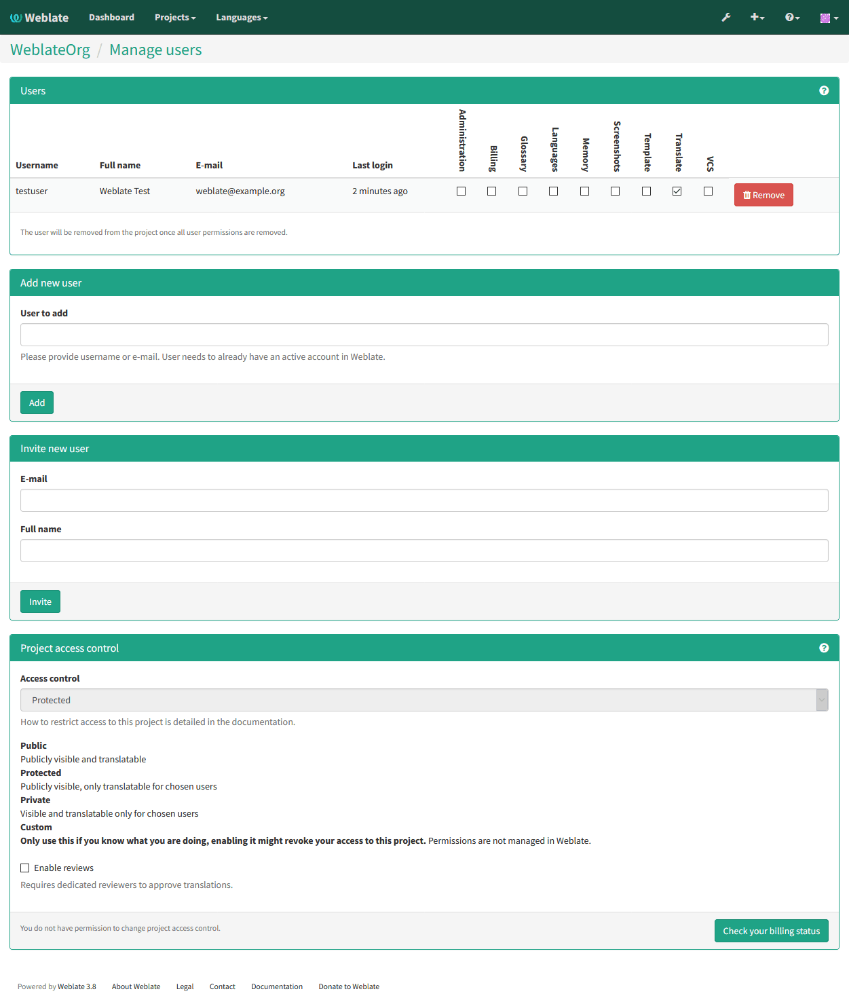

.. _workflows:

Translation workflows
=====================

Weblate can be configured to support several translation workflows. This
document is not a complete listing of ways to configure Weblate, there are
certainly more options. You can base another workflows on the most usual
examples listed here.

Translation access
------------------

The :ref:`privileges` is not much discussed in the workflows as each of
access control options can be applied to any workflows. Please consult that
documentation for information how to manage access to translations.

In following chapters, *any user* means any user who has access to the
translation. It can be any authenticated user if project is public or user
having :guilabel:`Translate` permission on the project.

Translation states
------------------

Each translated string can be in following states:

Untranslated
    Translation is empty, it might or not be stored in the file, depending
    on the file format.
Needs editing
    Translation needs editing, this is usually result of source string change.
    The translation is stored in the file, depending on the file format it might
    be marked as needing edit (eg. fuzzy flag).
Waiting for review
    Translation is done, but not reviewed. It is stored in the file as a valid
    translation.
Approved
    Translation has been approved in the review. It can no longer be changed by
    translators, but only by reviewers. Translators can only add suggestions to
    it.
Suggestions
    Suggestions are stored in Weblate only and not in the translation file.

Direct translation
------------------
This is most usual setup for smaller teams - anybody can directly translate.
This is also default setup in Weblate.

* *Any user* can edit translations.
* Suggestions are optional way to suggest changes, when translators are not
  sure about the change.

+------------------------+------------+-------------------------------------+
| Setting                |   Value    |   Note                              |
+========================+============+=====================================+
| Enable reviews         | disabled   | configured at project level         |
+------------------------+------------+-------------------------------------+
| Enable suggestions     | enabled    | it is useful for users to be able   |
|                        |            | suggest when they are not sure      |
+------------------------+------------+-------------------------------------+
| Suggestion voting      | disabled   |                                     |
+------------------------+------------+-------------------------------------+
| Autoaccept suggestions | 0          |                                     |
+------------------------+------------+-------------------------------------+
| Translators group      | Users      | or Translate with access control    |
+------------------------+------------+-------------------------------------+
| Reviewers group        | N/A        | not used                            |
+------------------------+------------+-------------------------------------+

.. _peer-review:

Peer review
-----------

With this workflow, anybody can add suggestions, however they need approval
from additional member before it is accepted as a translation.

* *Any user* can add suggestions
* *Any user* can vote for suggestions
* Suggestions become translations when they get given number of votes

+------------------------+------------+-------------------------------------+
| Setting                |   Value    |   Note                              |
+========================+============+=====================================+
| Enable reviews         | disabled   | configured at project level         |
+------------------------+------------+-------------------------------------+
| Enable suggestions     | enabled    |                                     |
+------------------------+------------+-------------------------------------+
| Suggestion voting      | enabled    |                                     |
+------------------------+------------+-------------------------------------+
| Autoaccept suggestions | 1          | you can set higher value to require |
|                        |            | more peer reviews                   |
+------------------------+------------+-------------------------------------+
| Translators group      | Users      | or Translate with access control    |
+------------------------+------------+-------------------------------------+
| Reviewers group        | N/A        | not used, all translators review    |
+------------------------+------------+-------------------------------------+

.. _reviews:

Dedicated reviewers
-------------------

.. versionadded:: 2.18

    The proper review workflow is supported since Weblate 2.18.

With dedicated reviewers you have two groups of users - one which can submit
translations and one which reviews them. Review is there to ensure the
translations are consistent and in a good quality.

* *Any user* can edit non approved translations.
* *Reviewer* can approve / unapproved strings.
* *Reviewer* can edit all translations (including approved ones).
* Suggestions are now also way to suggest changes for approved strings.

+------------------------+------------+-------------------------------------+
| Setting                |   Value    |   Note                              |
+========================+============+=====================================+
| Enable reviews         | enabled    | configured at project level         |
+------------------------+------------+-------------------------------------+
| Enable suggestions     | enabled    | it is useful for users to be able   |
|                        |            | suggest when they are not sure      |
+------------------------+------------+-------------------------------------+
| Suggestion voting      | disabled   |                                     |
+------------------------+------------+-------------------------------------+
| Autoaccept suggestions | 0          |                                     |
+------------------------+------------+-------------------------------------+
| Translators group      | Users      | or Translate with access control    |
+------------------------+------------+-------------------------------------+
| Reviewers group        | Reviewers  | or Review with access control       |
+------------------------+------------+-------------------------------------+

Enabling reviews
----------------

The reviews can be enabled on project configuration, you can find the setting
on bottom of :guilabel:`Manage users` page (to be found in the
:guilabel:`Manage/Users` menu):

.. note::

    Depending on Weblate configuration, the setting might not be available to
    you. For example on Hosted Weblate this is not available for projects hosted
    for free.
