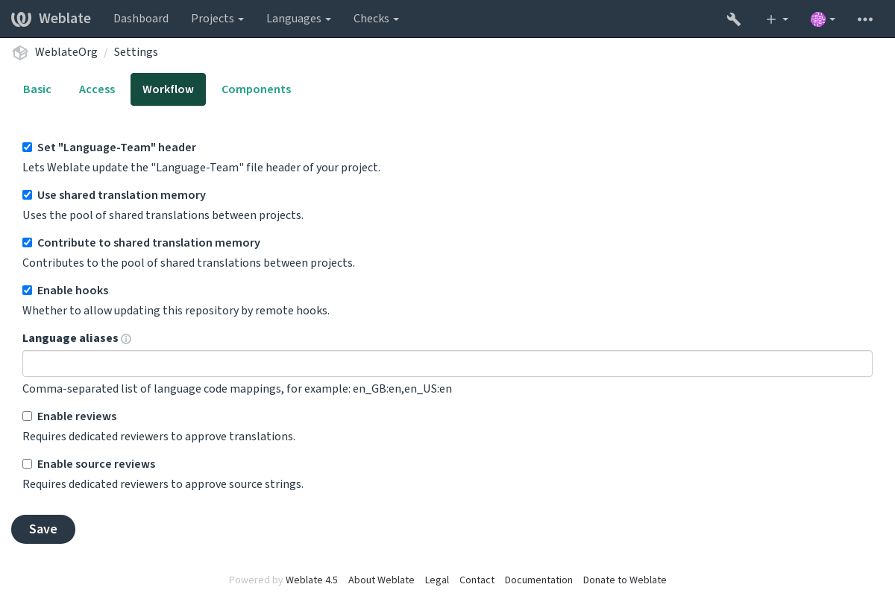

.. _workflows:

Translation workflows
=====================

Several translation workflows are supported.

The following is not a complete list of ways to configure Weblate.
You can base other workflows on the most usual examples listed here.

Translation access
------------------

The :ref:`privileges` is not much discussed in the workflows as each access control option can be applied to any workflow. Please consult that
documentation for information on how to manage access to translations.

In the following chapters, *any user* means a user who has access to the
translation. It can be any authenticated user if the project is public, or a user
that has a :guilabel:`Translate` permission for the project.

.. _states:

Translation states
------------------

Each translated string can be in one of following states:

Untranslated
    Translation is empty, it might or not be stored in the file, depending
    on the file format.
Needs editing
    Translation needs editing, this is usually the result of a source string change.
    The translation is stored in the file, depending on the file format it might
    be marked as needing edit (for example as it gets a fuzzy flag).
Waiting for review
    Translation is made, but not reviewed. It is stored in the file as a valid
    translation.
Approved
    Translation has been approved in the review. It can no longer be changed by
    translators, but only by reviewers. Translators can only add suggestions to
    it.
Suggestions
    Suggestions are stored in Weblate only and not in the translation file.

Direct translation
------------------
This is most usual setup for smaller teams, anybody can directly translate.
This is also the default setup in Weblate.

* *Any user* can edit translations.
* Suggestions are optional ways to suggest changes, when translators are not
  sure about the change.

+------------------------+------------+-------------------------------------+
| Setting                |   Value    |   Note                              |
+========================+============+=====================================+
| Enable reviews         | Off        | Configured at project level.        |
+------------------------+------------+-------------------------------------+
| Enable suggestions     | On         | It is useful for users to be able to|
|                        |            | suggest when they are not sure.     |
+------------------------+------------+-------------------------------------+
| Suggestion voting      | Off        |                                     |
+------------------------+------------+-------------------------------------+
| Autoaccept suggestions | 0          |                                     |
+------------------------+------------+-------------------------------------+
| Translators group      | Users      | Or Translate with access control.   |
+------------------------+------------+-------------------------------------+
| Reviewers group        | N/A        | Not used.                           |
+------------------------+------------+-------------------------------------+

.. _peer-review:

Peer review
-----------

With this workflow, anybody can add suggestions, and need approval
from additional member(s) before it is accepted as a translation.

* *Any user* can add suggestions.
* *Any user* can vote for suggestions.
* Suggestions become translations when given a predetermined number of votes.

+------------------------+------------+-------------------------------------+
| Setting                |   Value    |   Note                              |
+========================+============+=====================================+
| Enable reviews         | off        | Configured at project level.        |
+------------------------+------------+-------------------------------------+
| Enable suggestions     | on         |                                     |
+------------------------+------------+-------------------------------------+
| Suggestion voting      | on         |                                     |
+------------------------+------------+-------------------------------------+
| Autoaccept suggestions | 1          | You can set higher value to require |
|                        |            | more peer reviews.                  |
+------------------------+------------+-------------------------------------+
| Translators group      | Users      | Or Translate with access control.   |
+------------------------+------------+-------------------------------------+
| Reviewers group        | N/A        | Not used, all translators review.   |
+------------------------+------------+-------------------------------------+

.. _reviews:

Dedicated reviewers
-------------------

.. versionadded:: 2.18

    The proper review workflow is supported since Weblate 2.18.

With dedicated reviewers you have two groups of users, one able to submit
translations, and one able to review them to ensure translations are
consistent and that the quality is good.

* *Any user* can edit unapproved translations.
* *Reviewer* can approve / unapproved strings.
* *Reviewer* can edit all translations (including approved ones).
* Suggestions can also be used to suggest changes for approved strings.

+------------------------+------------+-------------------------------------+
| Setting                |   Value    |   Note                              |
+========================+============+=====================================+
| Enable reviews         | on         | Configured at project level.        |
+------------------------+------------+-------------------------------------+
| Enable suggestions     | off        | It is useful for users to be able to|
|                        |            | suggest when they are not sure.     |
+------------------------+------------+-------------------------------------+
| Suggestion voting      | off        |                                     |
+------------------------+------------+-------------------------------------+
| Autoaccept suggestions | 0          |                                     |
+------------------------+------------+-------------------------------------+
| Translators group      | Users      | Or Translate with access control.   |
+------------------------+------------+-------------------------------------+
| Reviewers group        | Reviewers  | Or Review with access control.      |
+------------------------+------------+-------------------------------------+

Turning on reviews
------------------

Reviews can be turned on in the project configuration, from the
:guilabel:`Workflow` subpage of project settings (to be found in the
:guilabel:`Manage` → `Settings` menu):

.. note::

    Depending on Weblate configuration, the setting might not be available to
    you. For example on Hosted Weblate this is not available for projects hosted
    for free.

.. _source-reviews:

Source strings reviews
----------------------

With :ref:`project-source_review` enabled, the review process can be applied on
the source strings. Once enabled, users can report issues in the source
strings.  The actual process depends on whether you use bilingual or
monolingual formats.

For monolingual formats, the source string review behaves similarly as with
:ref:`reviews` - once issue is reported on the source string, it is marked as
:guilabel:`Needs editing`.

The bilingual formats do not allow direct editing of the source strings (these
are typically extracted directly from the source code). In this case
:guilabel:`Source needs review` label is attached to strings reported by
translators. You should review such strings and either edit them in the source
or remove the label.

.. seealso::

    :ref:`bimono`,
    :ref:`reviews`,
    :ref:`labels`
